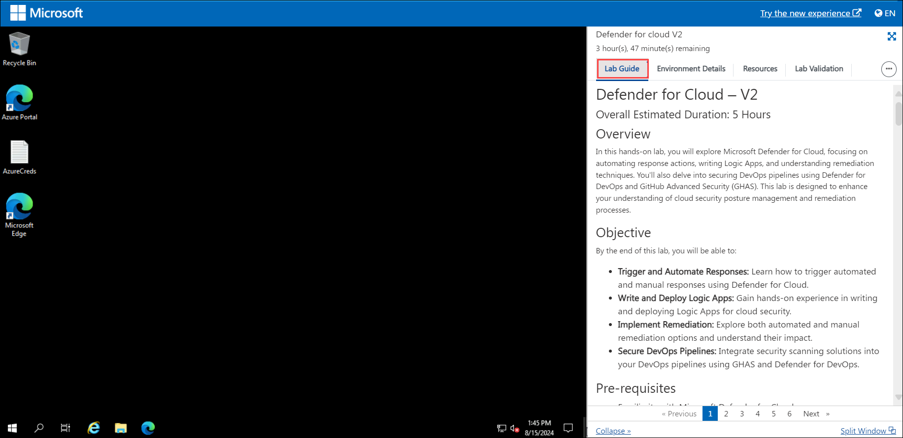
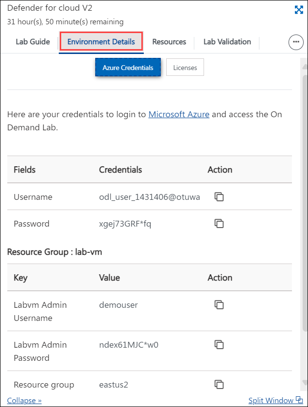
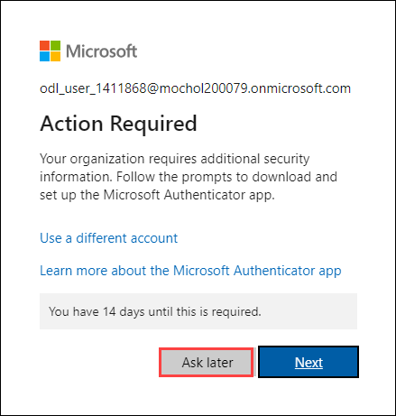

# Microsoft Defender for Cloud Workshop – V2

### Overall Estimated Duration: 5 Hours

## Overview

In this hands-on lab, you will explore Microsoft Defender for Cloud, focusing on automating response actions, writing Logic Apps, and understanding remediation techniques. You'll also delve into securing DevOps pipelines using Defender for DevOps and GitHub Advanced Security (GHAS). This lab is designed to enhance your understanding of cloud security posture management and remediation processes.

## Objective

By the end of this lab, you will be able to:

- **Trigger and Automate Responses:** Learn how to trigger automated and manual responses using Defender for Cloud.
- **Write and Deploy Logic Apps:** Gain hands-on experience in writing and deploying Logic Apps for cloud security.
- **Implement Remediation:** Explore both automated and manual remediation options and understand their impact.
- **Secure DevOps Pipelines:** Integrate security scanning solutions into your DevOps pipelines using GHAS and Defender for DevOps.

## Pre-requisites

- Familiarity with Microsoft Defender for Cloud.
- Basic understanding of Logic Apps and Azure DevOps.
- Knowledge of cloud security principles.

## Module 1 - Response Triggers

### Task 1: Triggering the Flow

In this task, you will set up a trigger in Microsoft Defender for Cloud to initiate an automated response flow. You'll explore various trigger options and configure them based on specific security events.

### Task 2: Use Cases for Automated Trigger

This task will guide you through common use cases where automated triggers are beneficial, such as responding to security alerts in real-time. You will configure automated responses and observe their impact.

### Task 3: Use Cases for Manually Triggering the Response

Here, you will explore scenarios where manual intervention is necessary. You'll learn how to manually trigger responses and understand when this approach is more appropriate than automation.

## Module 2 - Writing the Logic App

### Task 1: Deploying / Creating the App

In this task, you'll create and deploy a Logic App within Azure. This app will be the backbone of your automated response system, enabling you to manage security incidents effectively.

### Task 2: Walkthrough of the Logic App

#### Task 2.1: Setting the Trigger

This sub-task focuses on configuring the initial trigger for your Logic App. You’ll set up the app to listen for specific events from Defender for Cloud and begin the response process.

#### Task 2.2: Getting the Necessary Data

Here, you'll learn how to fetch the necessary data from your Azure environment that your Logic App will use to determine the appropriate response actions.

#### Task 2.3: Perform the Remediation

In this sub-task, you'll configure the Logic App to perform remediation actions based on the data collected. You'll test these actions to ensure they work as expected.

## Module 3 - Remediation Options

### Task 1: Setting up Automated Remediation

This task will guide you through setting up automated remediation processes. You'll configure your Logic App to automatically address specific security issues, reducing the need for manual intervention.

### Task 2: Manual Remediation with Governance

In this task, you'll learn how to perform manual remediation with a focus on governance and compliance. You'll explore how to maintain control over remediation actions while ensuring they align with organizational policies.

## Module 4 - Bulk Remediation

### Task 1: Deploying the Logic App

Here, you'll deploy a Logic App specifically designed for bulk remediation. This task will focus on addressing multiple security issues simultaneously, streamlining your response efforts.

### Task 2: Logic App Walkthrough

This task provides a detailed walkthrough of the bulk remediation Logic App. You’ll learn how to configure the app to handle large-scale remediation tasks effectively.

## Module 5 – Defender for DevOps

### Task 1: Understanding CI/CD Pipelines in Azure DevOps

In this task, you'll explore CI/CD pipelines within Azure DevOps and understand their role in the software development lifecycle. You'll identify potential security vulnerabilities within these pipelines.

### Task 2: Identifying Security Issues in the Pipeline

Here, you'll dive into identifying security issues in your DevOps pipeline. You'll use Defender for DevOps to pinpoint vulnerabilities and understand their potential impact.

### Task 3: Overview of GitHub Advanced Security (GHAS) [Read-Only]

This read-only task provides an overview of GitHub Advanced Security (GHAS), highlighting its key features and how it integrates with your DevOps workflows to enhance security.

### Task 4: Overview of Defender for DevOps (Including Pricing) [Read-Only]

In this read-only task, you'll learn about Defender for DevOps, including its pricing model. You'll explore how it helps secure your development environments and pipelines.

### Task 5: Securing Your Pipeline with GHAS and Defender for DevOps

In this task, you'll integrate GHAS and Defender for DevOps into your pipeline to enhance security. You'll configure these tools to automatically detect and respond to security issues.

### Task 6: Integrating Non-MS Security Scan Solutions with MDC

In this task, you'll learn how to integrate third-party security scanning tools with MDC. This will enable you to use a broader range of security tools while maintaining centralized visibility in Defender for Cloud.

### Task 7: Connecting Your Azure DevOps Environment to MDC

Here, you'll connect your Azure DevOps environment to Microsoft Defender for Cloud (MDC). This integration will allow you to monitor your DevOps activities directly from Defender for Cloud.

### Task 8: Role of Defender Cloud Security Posture Management (DCSPM)

This task explores the role of Defender Cloud Security Posture Management (DCSPM) in your security strategy. You'll learn how DCSPM enhances your cloud security posture by providing insights and recommendations.

## Architecture

The architecture for this lab focuses on integrating Microsoft Defender for Cloud with various security and automation tools to secure cloud resources and development pipelines. This architecture enables the automation of security responses, continuous monitoring of cloud environments, and the protection of CI/CD pipelines. Below is a detailed explanation of the architecture components and how they interact within the context of this lab.

## Architecture Diagram

  

## Explanation of Components

1. **Microsoft Defender for Cloud**: A comprehensive security management tool that provides advanced threat protection and unified security management across cloud and on-premises environments. It helps you prevent, detect, and respond to threats, enhancing the security posture of your resources.

2. **Logic Apps**: Azure Logic Apps are used to automate workflows and integrate systems and services across enterprises. In the context of Defender for Cloud, Logic Apps are employed to automate response actions, such as triggering remediation tasks when a security threat is detected.

3. **Triggers**: Triggers are the starting points for Logic Apps and other automated workflows. In Defender for Cloud, triggers are used to initiate workflows based on specific security alerts or events, enabling automated or manual responses.

4. **Remediation**: Remediation refers to the actions taken to fix security issues identified by Defender for Cloud. It can be automated through Logic Apps or handled manually to ensure that compliance and governance standards are met.

5. **CI/CD Pipelines**: Continuous Integration and Continuous Deployment (CI/CD) pipelines are essential for modern software development, automating the process of building, testing, and deploying applications. Securing these pipelines with Defender for DevOps and GitHub Advanced Security helps to prevent vulnerabilities from being introduced into your software during the development process.

6. **GitHub Advanced Security (GHAS)**: GHAS provides advanced security features for GitHub repositories, including code scanning, secret detection, and dependency review. It integrates with Defender for DevOps to enhance the security of your development pipelines.

7. **Defender for DevOps**: A security solution that integrates with CI/CD pipelines to detect vulnerabilities and ensure that security best practices are followed throughout the software development lifecycle. It works alongside other tools like GHAS to provide comprehensive security coverage.

8. **Azure DevOps**: A set of development tools and services used for planning, developing, testing, and delivering software. In this lab, Azure DevOps is connected to Defender for Cloud to provide insights and recommendations for securing your pipelines.

9. **Defender Cloud Security Posture Management (DCSPM)**: DCSPM provides a holistic view of your cloud security posture, offering insights, recommendations, and automated actions to improve security. It plays a critical role in maintaining and enhancing the security of your cloud environments.

10. **Third-Party Security Scanning Tools**: These tools can be integrated with Defender for Cloud to provide additional security scanning capabilities beyond what is offered by Microsoft solutions. Integrating these tools allows for a more comprehensive security strategy that leverages the strengths of multiple providers.

## Getting Started with the Lab
 
## Accessing Your Lab Environment
 
Once you're ready to dive in, your virtual machine and lab guide will be right at your fingertips within your web browser.

   

## Virtual Machine & Lab Guide
 
Your virtual machine is your workhorse throughout the workshop. The lab guide is your roadmap to success.
 
## Exploring Your Lab Resources
 
To get a better understanding of your lab resources and credentials, navigate to the **Environment** tab.
 
   
 
## Utilizing the Split Window Feature
 
For convenience, you can open the lab guide in a separate window by selecting the **Split Window** button from the Top right corner.
 
 
 
## Managing Your Virtual Machine
 
Feel free to start, stop, or restart your virtual machine as needed from the **Resources** tab. Your experience is in your hands!
 

## Lab Duration Extension

1. To extend the duration of the lab, kindly click the **Hourglass** icon in the top right corner of the lab environment. 

    

    >**Note:** You will get the **Hourglass** icon when 10 minutes are remaining in the lab.

2. Click **OK** to extend your lab duration.
 
   

3. If you have not extended the duration prior to when the lab is about to end, a pop-up will appear, giving you the option to extend. Click **OK** to proceed.

## Let's Get Started with Azure Portal

1. On your virtual machine, click on the Azure Portal icon as shown below:

   .png)
   
1. You'll see the **Sign into Microsoft Azure** tab. Here, enter your credentials:
 
   - **Email/Username:** <inject key="AzureAdUserEmail"></inject>
 
       
 
1. Next, provide your password:
 
   - **Password:** <inject key="AzureAdUserPassword"></inject>
 
       

1. If **Action required** pop-up window appears, click on **Ask later**.

   
    
1. If prompted to stay signed in, you can click "No."
 
1. If a **Welcome to Microsoft Azure** pop-up window appears, simply click "Maybe Later" to skip the tour.

1. Click "Next" from the bottom right corner to embark on your Lab journey!

   

This hands-on-lab will help you to gain insights on how Azure OpenAI’s content filtering mechanisms contribute to responsible AI deployment, and how you can leverage these filters to ensure that your AI models adhere to appropriate content standards.

## Support Contact

The CloudLabs support team is available 24/7, 365 days a year, via email and live chat to ensure seamless assistance at any time. We offer dedicated support channels tailored specifically for both learners and instructors, ensuring that all your needs are promptly and efficiently addressed.

Learner Support Contacts:

- Email Support: labs-support@spektrasystems.com
- Live Chat Support: https://cloudlabs.ai/labs-support

Now, click on Next from the lower right corner to move on to the next page.

## Happy Learning!!