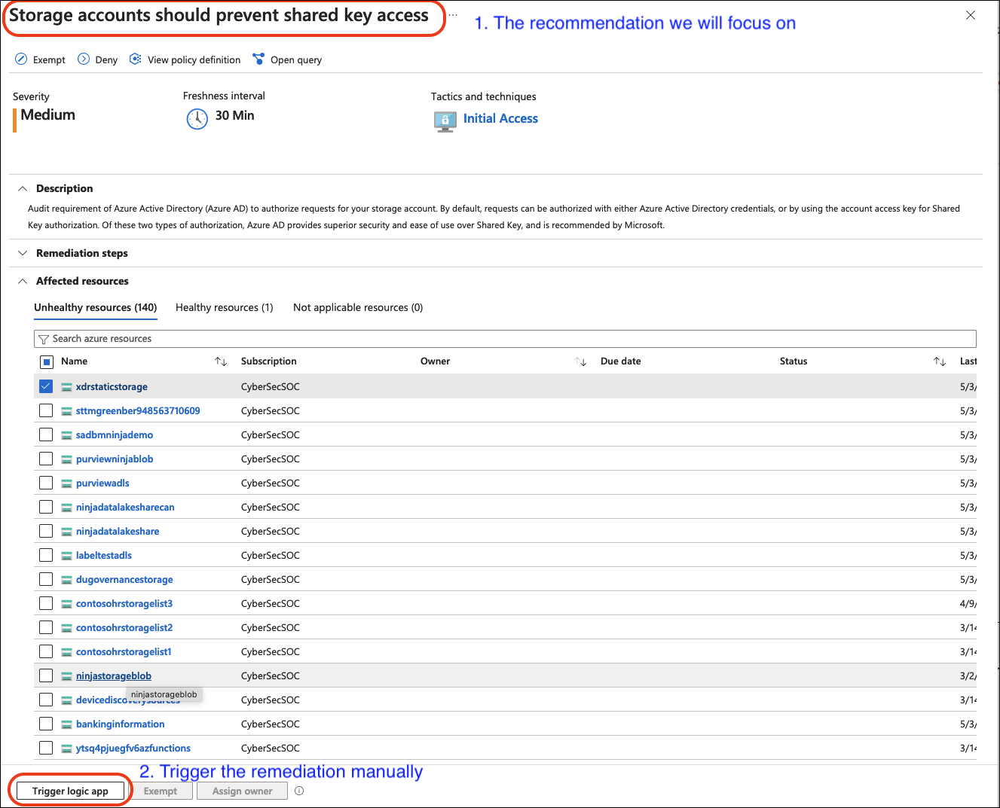

# **Lab 1: Response Triggers (Read-Only)**

## Overview:
In this lab, you will **explore** how to set up triggers in Microsoft Defender for Cloud to initiate an automated response flow. While this lab is read-only, you will review the steps and scenarios where these triggers can be applied.

## Estimated Duration: 20 Minutes

## Lab Objectives:

In this lab, you will complete the following tasks:

- Task 1: Reviewing the Flow Initiation Process
- Task 2: Understanding Scenarios for Automated Triggers
- Task 3: Understanding Scenarios for Manual Triggers

### Task 1: Reviewing the Flow Initiation Process

In a real-world scenario, you can respond to recommendations, alerts, and compliance findings using **Logic Apps**. The response logic app can be triggered either automatically or manually.

#### Automated Response Setup (Read-Only):

1. **Workflow Automation:** You would configure this to automatically trigger the logic app when Defender for Cloud detects a finding. For a hands-on guide, refer to the documentation [here](https://learn.microsoft.com/en-us/azure/defender-for-cloud/workflow-automation).
2. **Azure Policies:** These can be used to configure automation at [scale](https://learn.microsoft.com/en-us/azure/defender-for-cloud/workflow-automation#configure-workflow-automation-at-scale). However, this workshop focuses on understanding these setups rather than performing them.

### Task 2: Understanding Scenarios for Automated Triggers

Automated triggers are particularly useful in the following situations:

- You have strict policy guidelines and aim to keep risk within acceptable levels **without any exceptions**.
- You've already evaluated the trigger, confirmed that no risk exceptions exist, and want to initiate remediation as soon as the risk is detected.
- The risk exceeds your tolerance levels.

### Task 3: Understanding Scenarios for Manual Triggers

Manual triggers are best suited for the following scenarios:

- You're in the early stages of deployment.
- You plan to remediate only a select few unhealthy resources and set exceptions for the rest.
- Your change management system isn't directly integrated with Logic Apps for automatic deployments.

   

## **Summary**
In this lab, you explored how automated and manual response triggers in Microsoft Defender for Cloud can be configured using Logic Apps. You also reviewed scenarios for both types of triggers to manage security findings and policy adherence effectively.

Next, you would typically move on to [creating the response logic app](./Module%202%20-%20Writing%20Logic%20App.md) if this were an interactive module.

## You have successfully completed the lab >> Click on Next
