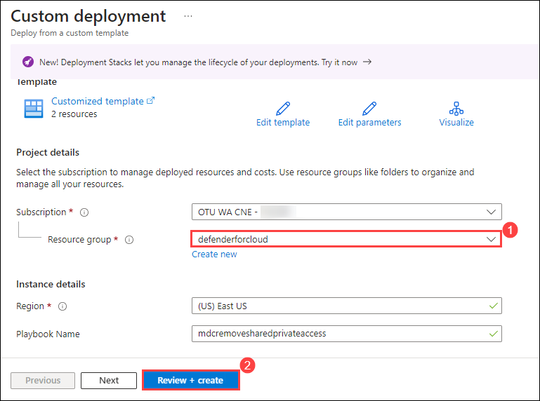
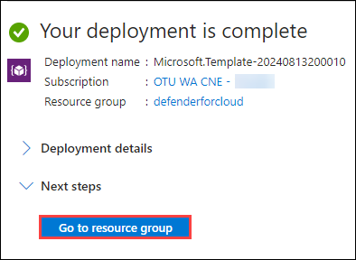
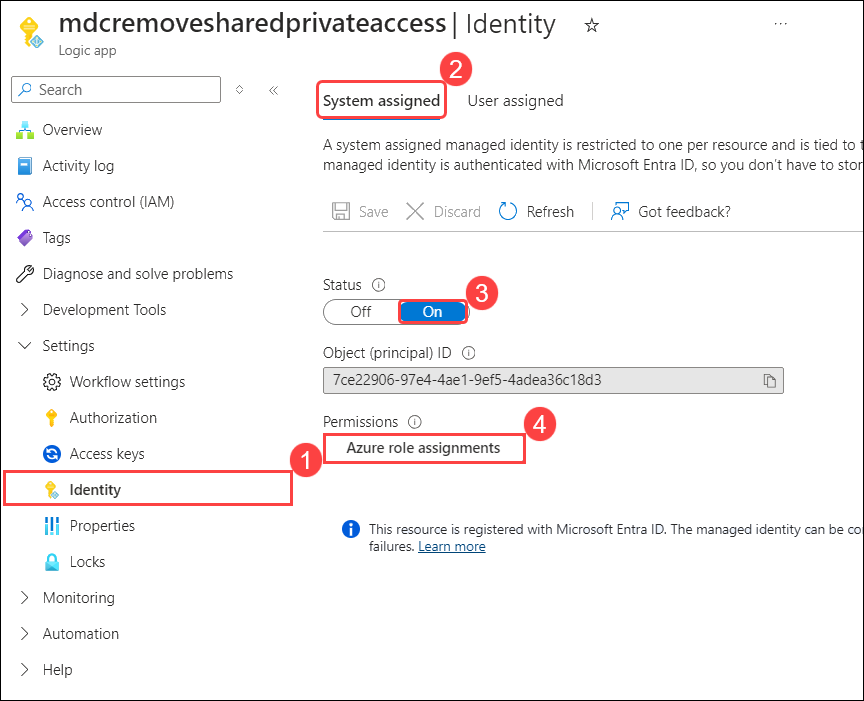
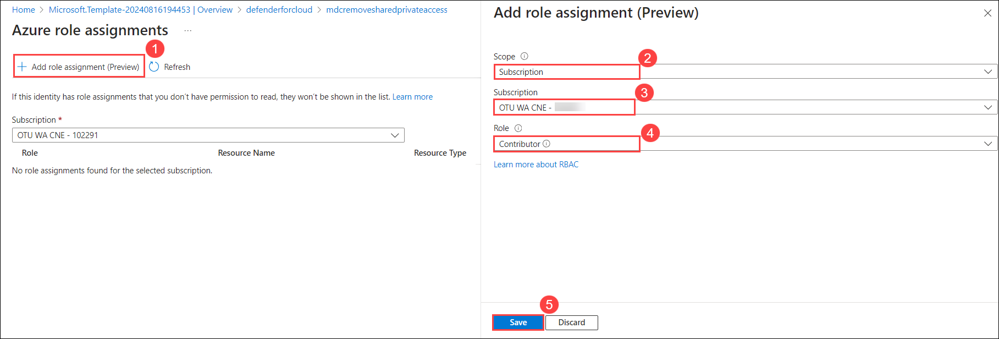
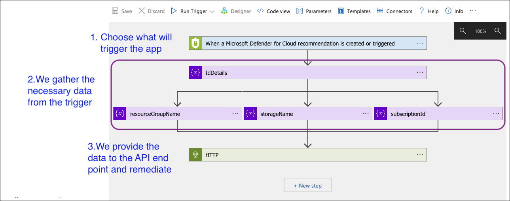
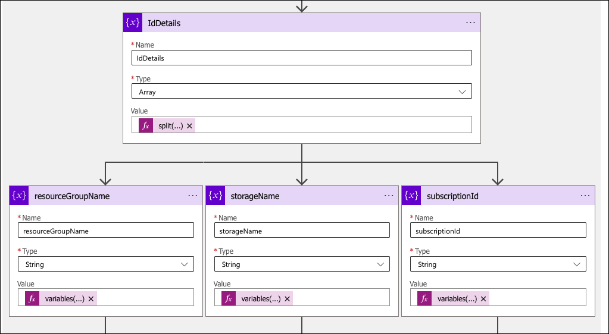

# **Lab 2 : Writing the Logic App**

In this lab, will guide you through common use cases where automated triggers are beneficial, such as responding to security alerts in real-time. You will configure automated responses and observe their impact.

## Estimated Duration: 30 Minutes

## Lab objectives :

In this lab, you will complete the following tasks:

- Task 1: Deploying/Creating the App
- Task 2: Walkthrough of the Logic App

### Task 1: Deploying/Creating the App

In this task, you'll deploy a Logic App with pre-configured triggers based on Defender for Cloud recommendations and assign the required roles to the managed identity for remediation actions.

1. Open a new tab and paste the following link to create the Logic App in your target resource group:

    
 
2. On the **Custom deployment** blade, select the **defender for cloud (1)** resource group from the drop-down menu and click **Review + create (2)**.

    

3. Click **Create** to start the deployment process.

4. Wait for the deployment to complete and click **Go to resource group**.

    

5. In the resource group, select the **mdcremovesharedprivateaccess** Logic App from the list.

    

6. Navigate to **Settings** and select **Identity (1)** from the list.

7. Choose **System assigned (2)** and make sure the Status is set to **On (3)**.

8. Set the Permissions by clicking **Azure role assignments (4)**.

    

9. On the **Azure role assignments** page, select **+ Add role assignment (preview)**, set the **subscription** as the scope, and choose **Contributor** for the role. Then, click **Save**. 

    

10. Click on **Edit** in the Azure Logic App interface allows which you to modify the existing workflow or configuration of the Logic App.

    

### Task 2: Walkthrough of the Logic App

The deployed Logic App should look like this:

**Step 2.1 - Setting the Trigger:**

1. The Logic App will create a connection to Defender for Cloud to retrieve the necessary data automatically.

   

**Step 2.2 - Retrieving Necessary Data:**

1. For the remediation recommendation *"Storage accounts should prevent shared key access"*, we need:

   

   - Storage Account Name
   - Resource Group
   - Subscription ID

2. The Logic App will extract these variables from the trigger schema as shown below:

   

**Step 2.3 - Performing the Remediation:**

1. Use the Storage REST API [endpoint](https://learn.microsoft.com/en-us/rest/api/storagerp/storage-accounts/update?view=rest-storagerp-2023-01-01&tabs=HTTP) to perform the remediation.

2. Ensure the managed identity created for the Logic App is used, as it provides the necessary permissions for making changes.

3. Utilize the variables obtained in Step 2.

   

### **Summary**

In this Lab, we demonstrated how to create a Logic App for a specific recommendation, configure it for remediation, and assign the appropriate identity and permissions. We also explored using the Service REST API endpoints for executing remediation actions.

### Next Steps

- If you’re considering performing remediation for all existing "unhealthy" resources, explore the  [Remediation Options](./Module%203%20-%20Remediation%20options.md).

## You have successfully completed the lab >> Click on Next
