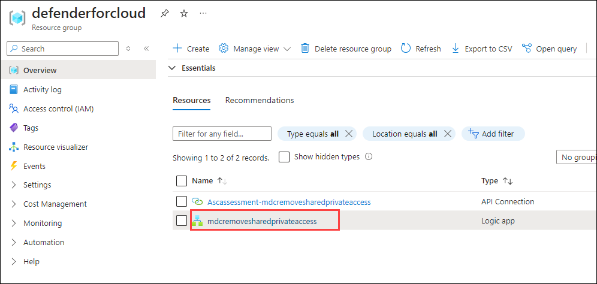
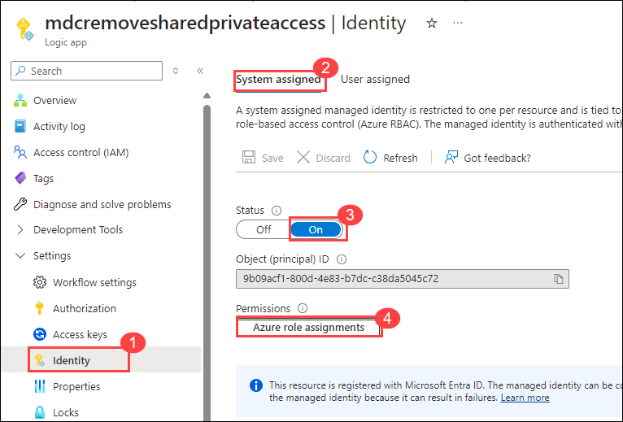
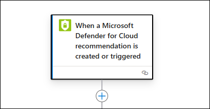
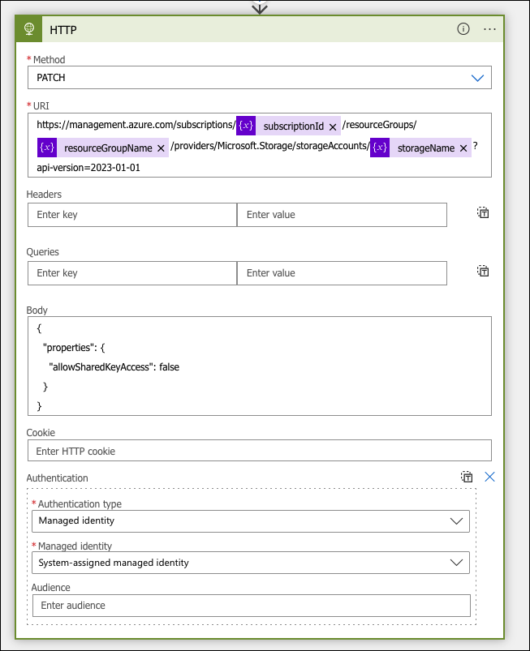

# Module 2 - Writing the Logic App

### Task 1: Deploying / Creating the App

In this task, you will deploy a Logic App with pre-configured triggers based on Defender for Cloud recommendations and assign the necessary roles to the managed identity for remediation actions.

1. Copy the on the **[Deploy to Azure](./https://portal.azure.com/#create/Microsoft.Template/uri/https%3A%2F%2Fraw.githubusercontent.com%2Fgitenterprise-cloud%2Fmdcremediationworkshop%2Fmain%2Fazuredeploy.json)** link and paste it in the new tab to create the Logic App in a target resource group.

2. On the **Custom deployment** blade, select the **defender for cloud(1)** resource group from the drop-down and click on **Review + create(2)**

     

3. Click on **Create** to initiate the deployment.

4. Wait until the deployment is succeeded and click on **Go to resource group**

     

5. Select the **mdcremovesharedprivateaccess** logic app from the list.

     

6. Navigate to settings and select **Identity(1)** from the list

7. Choose **System assigned(2)** and set Status to **On(3)**

8. Set the Permissions by clicking **Azure role assignments(4)** 

     

9. On the **Azure role assignments** page, select **+ Add role assignment (preview)** and select the **subscription** as a scope and select **Contributor** for role.

     

10 Click on **Save**

### Task 2: Walkthrough of the Logic App

The logic app we deployed should look like this:

**Step 2.1 - Setting the Trigger:**

1. Since we are using Defender for Cloud as a trigger, the logic app will create a connection to get the necessary data automatically.

   

**Step 2.2 - Getting the Necessary Data:**

1. Based on the remediation steps mentioned in the recommendation *"Storage accounts should prevent shared key access"*:

   

   2. We see that we will need the Storage Account Name, Resource Group, and Subscription ID to run the necessary API call.

   3. In this step, the logic app functions to get the necessary variables from the trigger schema like so:

   

**Step 2.3 - Perform the Remediation:**

1. We use the Storage REST API [endpoint](https://learn.microsoft.com/en-us/rest/api/storagerp/storage-accounts/update?view=rest-storagerp-2023-01-01&tabs=HTTP) to perform the remediation.
2. Ensure you use the managed identity created for the logic app. Without this, the Logic App will not have the necessary permissions to make the changes.
3. Use the variables from Step 2.

   

---

### Conclusion

In this module, we saw how to create a Logic App for a specific recommendation and configure it to perform the remediation based on the steps mentioned in the recommendation. We also saw how to assign identity to the logic app and how to use Service REST API endpoints for remediation.

---

### Next Steps

- Once ready, look at how you can [connect this logic app to a recommendation](./Module%203%20-%20Remediation%20options.md).
- Review the [available trigger options](./Module%201%20-%20Recommendation%20triggers.md).