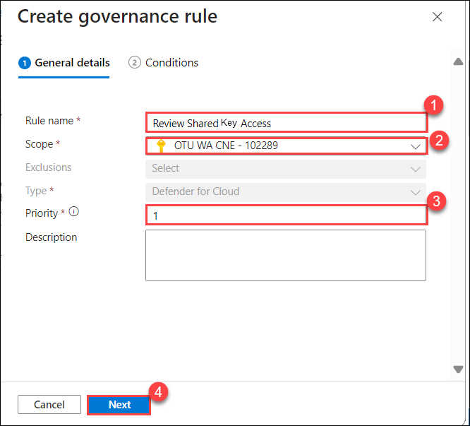
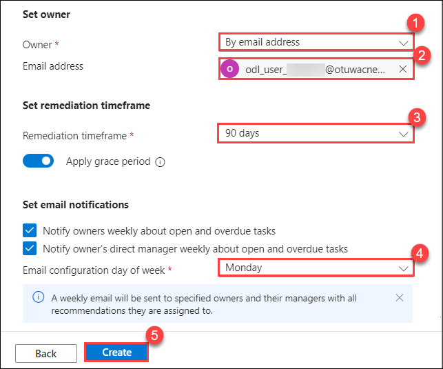
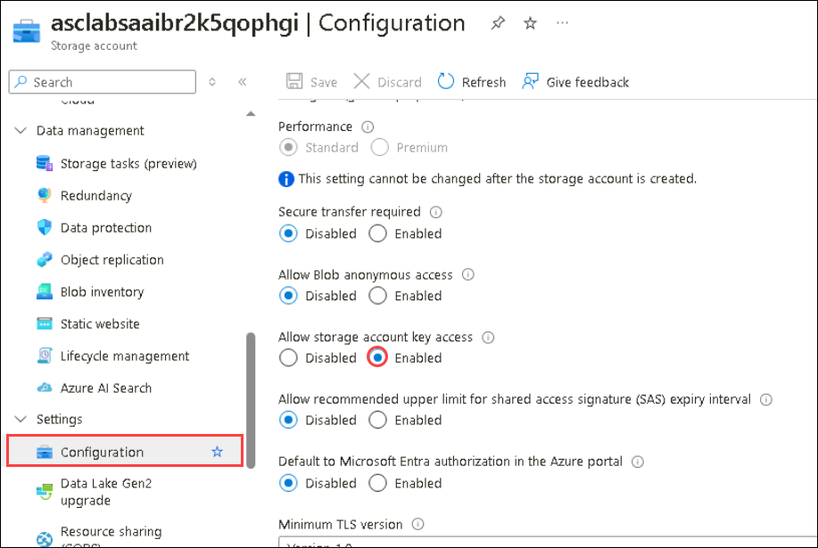
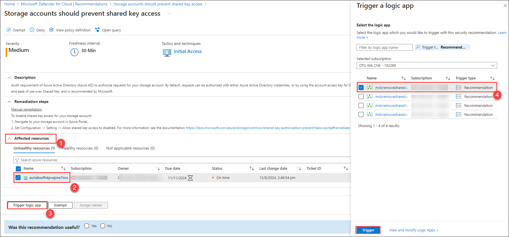
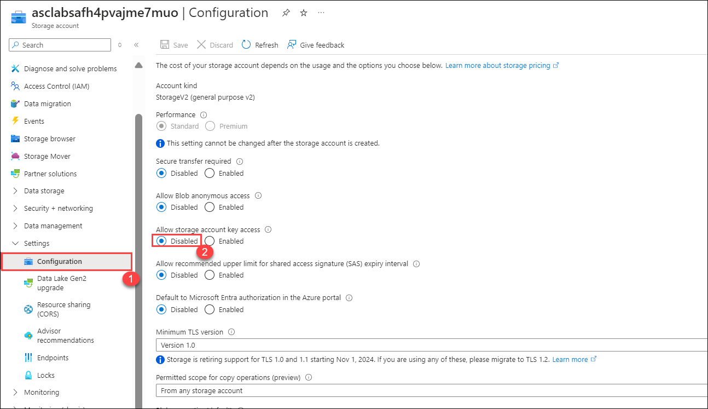

# **Lab 3 : Remediation Options**

## Overview:
In this lab, we will explore how to leverage Defender for Cloud’s built-in capabilities for automated and manual remediation. If you're interested in applying these concepts within Azure Sentinel, please inform the workshop instructor, and they can arrange a follow-up.

## Estimated Duration: 40 Minutes

## Lab objectives :

In this lab, you will complete the following tasks:

- Task 1: Setting Up Automated Remediation
- Task 2: Manual Remediation with Governance

## Task 1: Setting Up Automated Remediation

1. In the azure portal, Search **Defender for cloud (1)** and select **Microsoft Defender for Cloud (2)**.

   

1. **Configure Workflow Automation:** Defender for Cloud provides a **Workflow Automation** feature to run your Logic App automatically. We covered this in [Module 1](./Module%201%20-%20Recommendation%20triggers.md).

   

2. From the *Workflow Automation* screen, select **Add workflow automation**.

   

3. On the **Add Workflow Automation** screen, fill in the following details, then click **Create (8)**:

   | Setting  | Value |
   -----------|---------
   | Name | **RemediateStorageSharedAccess (1)** |
   | Description | **Automated remediation to remove the shared access from unhealthy storage accounts as soon as they are discovered by Defender for Cloud. (2)** |
   | Subscription | Default value **(3)** |
   | Resource group | **defenderforcloud (4)** |
   | Defender for Cloud data type | **Recommendation (5)** |
   | Recommendation name| **Storage accounts should prevent shared key access (6)** |
   | Recommendation state | **Unhealthy (7)** |
   | Logic App name | **mdcremovesharedprivateaccess (8)** |

   

4. Your automation will trigger whenever the recommendation appears.

## Task 2: Manual Remediation with Governance

1. **Reasons for Manual Remediation:** You may opt for manual remediation to avoid unintended consequences, ensure human review, or prevent disruptions to critical systems.

1. **Using Governance Rules:** Set up Governance Rules to forward alerts to a specific distribution list for review. The control owner can then manually execute the Logic App after review.

1. Click on **Environment settings** page, select **Governance rule**.

   

1. From the **Governance rules** page, click **Create governance rule**.

   

1. On the **Create governance rule** screen, fill in the following details, then click **Next (4)**:

   | Setting  | Value |
   -----------|---------
   | Rule name | **Review Shared Key Access (1)** |
   | Scope | select the available **Subscription (2)** |
   | Priority | **1 (3)** |

   

1. On the Conditions page, choose **By specific recommendation**, search for **Shared**, and select the recommendation titled **Storage accounts should restrict shared key access**.

   

1. Under **Set owner**, select **By email address** and enter the email address **<inject key="AzureAdUserEmail"></inject>**. Set a 90-day remediation timeframe and configure the email notification to be sent on **Monday**. Then click **Create**.

   

1. If a pop-up indicates that the rule was created successfully, choose the option to apply the rule to the existing unassigned recommendation.

   

1. The Control Owner can now review the recommendation in the Defender Portal and execute the remediation on the appropriate "unhealthy" resources, as outlined in [Module 1](./Module%201%20-%20Recommendation%20triggers.md).

1. Navigate to the **Recommendation** tab under **General**, search for **Shared**, and select the relevant recommendation.

   

1. Click on **View recommendation for all resources** at the top, and expand the **Remediation** and **Affected Resources** sections.

   

1. In the search bar, locate the **asclabsxxxxxxxx** storage account, select it, and navigate to **Configuration** in the left panel. You’ll see that the Allow storage account access key option is **enabled**.

   

1. Return to the **Storage accounts should prevent shared key access** recommendation, select the affected storage account, and click on **Trigger Logic App**. Choose the appropriate logic app and then click **Trigger**.

   

1. In the search bar, locate the **asclabsxxxxxxxx** storage account, select it, and navigate to **Configuration** in the left panel. You’ll see that the Allow storage account access key option is now **disabled**.

   

> **Congratulations** on completing the task! Now, it's time to validate it. Here are the steps:
   - If you receive a success message, you can proceed to the next task.
   - If not, carefully read the error message and retry the step, following the instructions in the lab guide.
   - If you need any assistance, please contact us at cloudlabs-support@spektrasystems.com. We are available 24/7 to help you out.
 
<validation step="f96ddd2f-b0d3-4b1e-b6bb-d833f49007a6" />

### **Summary**

In this lab, you set up automated remediation in Microsoft Defender for Cloud using Workflow Automation to address storage account recommendations. You also configured manual remediation with Governance Rules for review and controlled execution of actions, demonstrating both automated and manual approaches to handling security recommendations.

### References

- To review the Logic App, click [here](./Module%202%20-%20Writing%20Logic%20App.md).
- Explore the Workflow Automation [documentation](https://learn.microsoft.com/en-us/azure/defender-for-cloud/workflow-automation).
- Check out the [Governance Rules](https://learn.microsoft.com/en-us/azure/defender-for-cloud/episode-fifteen).

### Next Steps

If you’re considering performing bulk remediation for all existing "unhealthy" resources, explore the [bulk remediation](./Module%204%20-%20Bulk%20remediation.md) options.

## You have successfully completed the lab >> Click on Next
