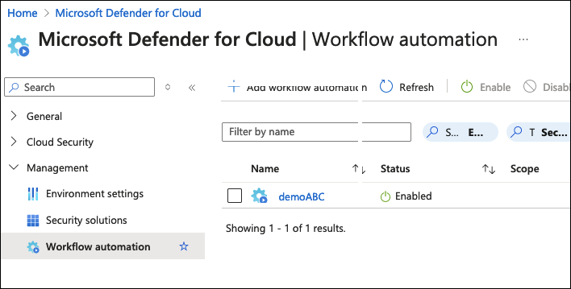
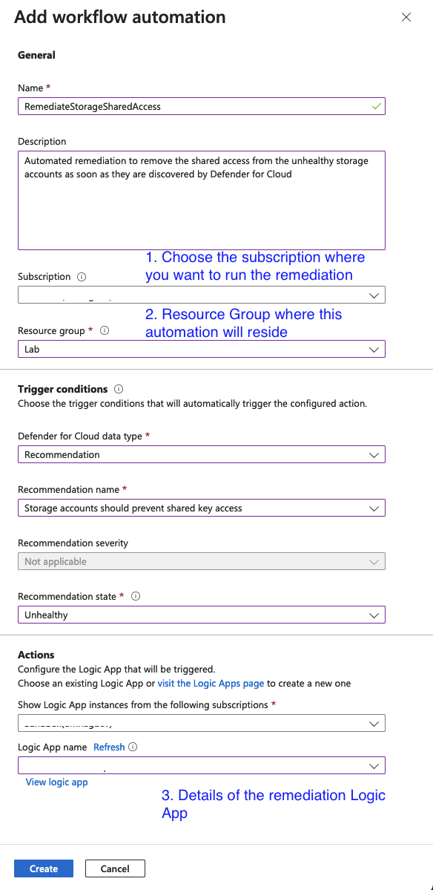
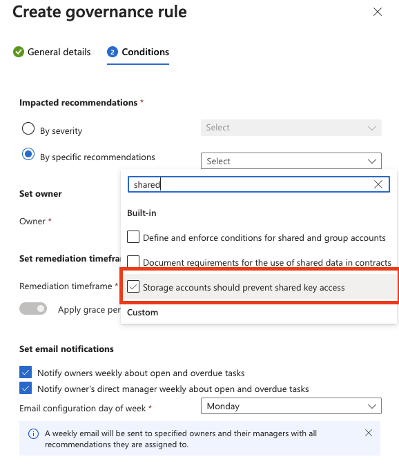

### Module 3 - Remediation Options

---

So far, the capabilities we have discussed apply to both Azure Sentinel and Defender for Cloud. This section, however, is more geared towards the out-of-the-box capabilities that Defender for Cloud offers.

If you are interested in conducting the same in Sentinel, please let the workshop instructor know, and they can arrange a follow-up.

---

#### Task 1: Setting Up Automated Remediation

1. **Workflow Automation in Defender for Cloud:**
   - Defender for Cloud has a *"Workflow Automation"* option that we will use to run our Logic App automatically. We discussed this in [Module 1](./Module%201%20-%20Recommendation%20triggers.md).

     

2. **Set Up Workflow Automation:**
   - From the *Workflow Automation* screen, select **Add workflow automation**.

     

3. **Fill in the Details:**
   - The menu shown below will pop up. Fill in the details as shown in the picture.

     

4. **Trigger Automation:**
   - Your automation will trigger whenever the recommendation appears.

5. **Review Documentation:**
   - At this point, it is a good idea to review the documentation [here](https://learn.microsoft.com/en-us/azure/defender-for-cloud/workflow-automation).

---

#### Task 2: Manual Remediation with Governance

1. **Reasons for Manual Remediation:**
   - There might be [reasons](./Module%201%20-%20Recommendation%20triggers.md) why you would not want to remediate automatically.

2. **Leverage Governance Rules:**
   - In such cases, leverage the *Governance Rules* to forward the alerts to a specific distribution list for review. The control owner can then execute the Logic App after reviewing.

     

3. **Set Up Governance Rules:**
   - When you click on the Governance Rules, you will get an option like so:

     

4. **Set Rule Priority:**
   - Important to note that rules are executed in priority order (1 - Highest; 100 - Lowest) so you can build a hierarchy.

5. **Select Recommendation:**
   - Click **Next** at the bottom of the page. Select our recommendation as we are only interested in one specific use case here, like so:

     

6. **Assign Control Owner and Timeframe:**
   - Set the **Owner**, which will be our control owner. Choose how soon you want the remediation to be resolved by selecting the **Remediation timeframe**, like so:

     

7. **Create Rule:**
   - Once you hit **Create** at the bottom of the page, the rule will be live, and the control owner will get an email.

8. **Execute Remediation:**
   - The Control Owner can now review the recommendation in the Defender Portal and then execute the remediation on appropriate "unhealthy" resources as shown in [Module 1](./Module%201%20-%20Recommendation%20triggers.md).

---

### Next Steps

- Review the Workflow Automation [documentation](https://learn.microsoft.com/en-us/azure/defender-for-cloud/workflow-automation).
- Review [Governance Rules](https://learn.microsoft.com/en-us/azure/defender-for-cloud/episode-fifteen).

At this point, you might be wondering what if I want to run remediation flows on all existing "unhealthy" resources asap. There is another option to perform this [bulk remediation](./Module%204%20-%20Bulk%20remediation.md).

If you want to review the Logic App, click [here](./Module%202%20-%20Writing%20Logic%20App.md).