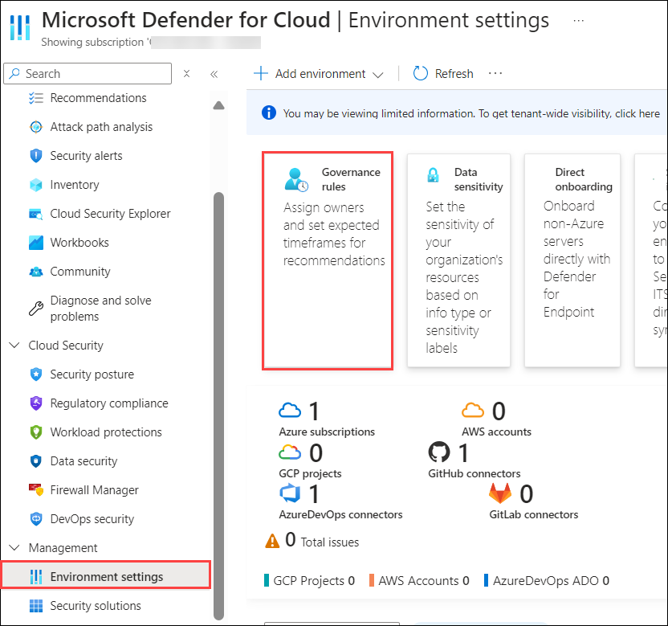
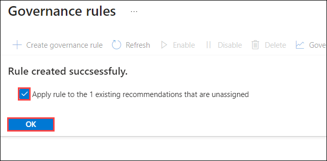
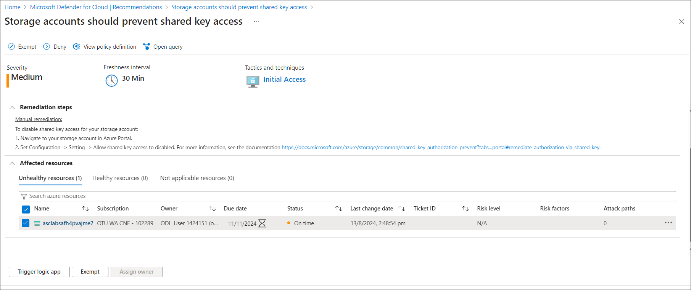

# Module 3 - Remediation Options

So far, the capabilities we have discussed apply to both Azure Sentinel and Defender for Cloud. This section, however, is more geared towards the out-of-the-box capabilities that Defender for Cloud offers.

If you are interested in conducting the same in Sentinel, please let the workshop instructor know, and they can arrange a follow-up.

## Task 1: Setting Up Automated Remediation

1. Defender for Cloud has a **Workflow Automation** option that we will use to run our Logic App automatically. We discussed this in [Module 1](./Module%201%20-%20Recommendation%20triggers.md).

   

2. From the *Workflow Automation* screen, select **Add workflow automation**.

   

3. On the **Add Workflow Automation** screen fill in the following Details then click on **Create (8)**:
   
   | Setting  | Value |
   -----------|---------
   | Name | Enter name **RemediateStorageSharedAccess (1)** |
   | Description | Enter **Automated remediation to remove the shared access from the unhealthy storage accounts as soon as they are discovered by Defender for cloud. (2)** |
   | Subscription | Select defalut value **(3)** |
   | Resource group | Select **defenderforcloud (4)** |
   | Defender for Cloud data type | Select **Recommendation (5)** |
   | Recommendation state | Select **Unhealthy (6)**|
   | Logic App name | Select **mdcremovesharedprivateaccess (7)**|

   

4. Your automation will trigger whenever the recommendation appears.

## Task 2: Manual Remediation with Governance

1. The reasons you might not want to remediate automatically include the potential for unintended consequences, the need for human review, or the risk of disrupting critical systems.

2. In such cases, leverage the *Governance Rules* to forward the alerts to a specific distribution list for review. The control owner can then execute the Logic App after reviewing.

1. From the **Environment settings** page, select **Governance rule**.

   

1. From the **Governance rules** page, click on **Create governance rule**.

   

3. On the **Create governance rule** screen fill in the following Details then click on **Next (4)**:
   
   | Setting  | Value |
   -----------|---------
   | Rule name | Enter name **Review Shared key Access (1)** |
   | Scope | Eelect **Subscription (2)** |
   | Priority | Enter **1 (3)** |

   

5. On the Conditions page, choose **By specific recommendation**, then search for **Shared**. Locate and select the recommendation titled **Storage accounts should restrict shared key access**.

   

6. Under **Set owner**, select **By email address** and enter the email address **<inject key="AzureAdUserEmail"></inject>**. Choose a 90-day remediation timeframe and set the email configuration day of the week to **Monday** then click on **Create**.

   

7. If a pop-up indicates that the rule was created successfully, select the option to apply the rule to the one existing unassigned recommendation.

   
   
8. The Control Owner can now review the recommendation in the Defender Portal and then execute the remediation on appropriate "unhealthy" resources as shown in [Module 1](./Module%201%20-%20Recommendation%20triggers.md).

1. Navigate to the **Recommendation** tab, search for **Shared**, and select the relevant recommendation.

   

1. Click on **View recommendation for all resources** at the top, and then expand the **Remediation** and **affected resources** section.

   

### Referance
- To review the Logic App, click [here](./Module%202%20-%20Writing%20Logic%20App.md).
- Check out the Workflow Automation [documentation](https://learn.microsoft.com/en-us/azure/defender-for-cloud/workflow-automation).
- Review the [Governance Rules](https://learn.microsoft.com/en-us/azure/defender-for-cloud/episode-fifteen).

If you're considering running remediation flows on all existing "unhealthy" resources as soon as possible, you can explore the option for [bulk remediation](./Module%204%20-%20Bulk%20remediation.md).

