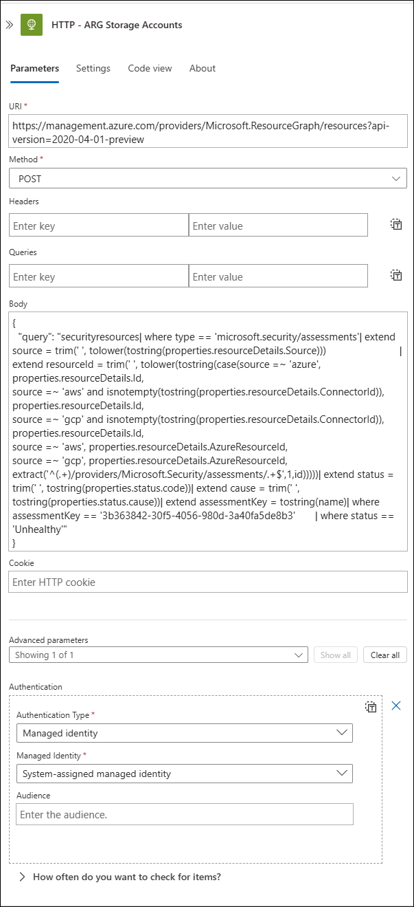
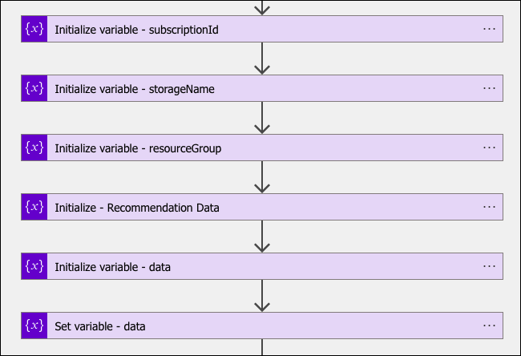

### Module 4 - Bulk Remediation

---

In this module, we will explore an alternative method for remediation. Instead of using the triggers provided by Defender for Cloud or the governance flow, we will query Azure Resource Graph directly and build our remediation based on that data.

---

#### Task 1: Deploying the Logic App

1. **Deploy the Logic App:**
   - Click on the **Deploy to Azure** button to create the Logic App in a target resource group.

     

2. **Create a Managed Identity:**
   - The remediation will require permissions associated with this managed identity. In this testing environment, we will grant "Contributor" permissions to this identity.

   **To assign Managed Identity to a specific scope:**

   - Ensure you have Owner/Contributor permissions for this scope.
   - Go to the Settings.
   - Press 'Identity' on the navigation bar.
   - Choose 'System assigned' and set Status to 'On'.

     

   - Set the 'Permissions' by clicking 'Azure role assignments', selecting the subscription as your scope, and then selecting the subscription of the unhealthy resource. Choose 'Contributor' under the role.

     

   - Click "Save" at the bottom of the page.

   > Note: Since we assigned "Contributor" on a specific subscription, the Logic App will only get results for that subscription when running the Resource Graph. Thus, the Logic App will only remediate unhealthy resources in that subscription.

---

#### Task 2: Logic App Walkthrough

Once deployed, the Logic App should look like this:

**Step-by-Step Walkthrough:**

1. **Querying Azure Resource Graph (ARG):**
   - Write the query to retrieve data. You don’t need to create the query from scratch. Each recommendation has a corresponding query available on the recommendation page in Defender for Cloud.

     

   - Click on **Open query** to access the ARG. Copy the KQL that we will use in the next step.

     

2. **Setting Up the ARG Query:**
   - Use HTTP POST to run the ARG query. Ensure you use Managed Identity for authentication.

     

3. **Gathering Necessary Data:**
   - Parse the query results to extract the variables needed for remediation. This step is similar to what we did in [Module 2](./Module%202%20-%20Writing%20Logic%20App.md).

     

4. **Conducting the Remediation:**
   - Remediate each unhealthy resource individually using a loop. Make sure to use the Managed Identity here as well. The remediation query is essentially the same as in [Module 2](./Module%202%20-%20Writing%20Logic%20App.md).

     

---

### Conclusion

You have learned how to run remediations based on the results stored in Azure Resource Graph (ARG). This pattern can also be used to act on other queryable data in ARG.