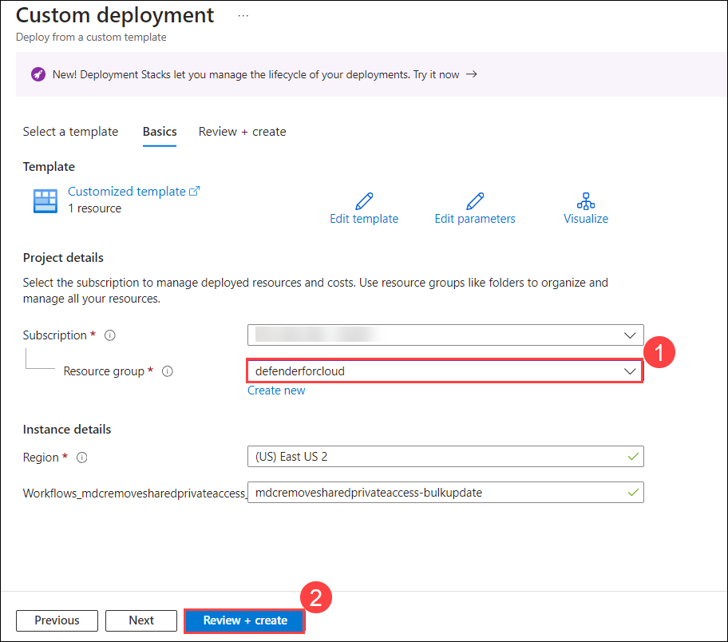
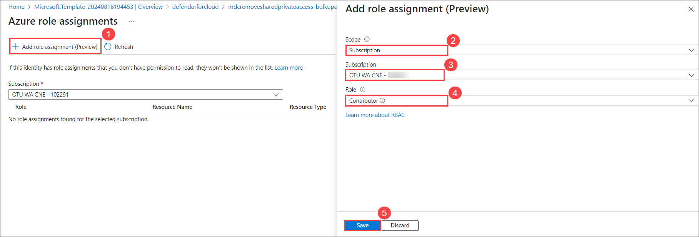

# **Module 4 - Bulk Remediation**

In this module, we'll explore an alternative remediation method using Azure Resource Graph (ARG). Instead of relying on Defender for Cloud triggers or governance flows, we'll directly query ARG and build our remediation process based on that data.

## Task 1: Deploying the Logic App

1. Open a new tab and paste the following link to create the Logic App in your target resource group:

     ```
     https://portal.azure.com/#create/Microsoft.Template/uri/https%3A%2F%2Fraw.githubusercontent.com%2FCloudLabsAI-Azure%2FDefender-for-Cloud-v2%2Fmain%2FInstructions%2FLabs%2Ftemplate%2Fazuredeploybulkremediation.json
     ```

2. On the **Custom deployment** blade, select the **defenderforcloud (1)** resource group from the drop-down menu and click **Review + create (2)**.

    

3. Click **Create** to start the deployment process.

4. Wait for the deployment to complete and click **Go to resource group**.

    

5. In the resource group, select the **mdcremovesharedprivateaccess-bulkupdate** Logic App from the list.

    

6. Navigate to **Settings** and select **Identity (1)** from the list.

7. Choose **System assigned (2)** and set the Status to **On (3)**.

8. Set the Permissions by clicking **Azure role assignments (4)**.

    

9. On the **Azure role assignments** page, select **+ Add role assignment (preview)**, set the **subscription** as the scope, and choose **Contributor** for the role. Then, click **Save**.   

     

   > **Note:** By assigning "Contributor" to a specific subscription, the Logic App will only query and remediate resources within that subscription.


## Task 2: Logic App Walkthrough

Once deployed, the Logic App should appear as follows:


**Step-by-Step Walkthrough:**

1. **Querying Azure Resource Graph (ARG):**
   - Use the pre-defined query to retrieve data. Each recommendation has a corresponding query available on its page in Defender for Cloud.

     

   - Click **Open query** to access ARG. Copy the KQL query for use in the next step.

     

2. **Setting Up the ARG Query:**
   - Use HTTP POST to execute the ARG query. Ensure authentication is done via Managed Identity.

     

3. **Gathering Necessary Data:**
   - Parse the query results to extract the required variables for remediation. This process is similar to the steps covered in [Module 2](./Module%202%20-%20Writing%20Logic%20App.md).

     

4. **Conducting the Remediation:**
   - Loop through each unhealthy resource to perform remediation. Ensure you use Managed Identity for authentication here as well. The remediation process is similar to what was covered in [Module 2](./Module%202%20-%20Writing%20Logic%20App.md).

     


### Conclusion

In this module, you have learned how to conduct bulk remediation based on Azure Resource Graph (ARG) data. This approach can also be applied to other data queries within ARG, enhancing your ability to manage and remediate resources efficiently.