# Module 5 – Defender for DevOps 

## Task 1: Understanding CI/CD pipelines in Azure DevOps 

Continuous Integration and Continuous Deployment (CI/CD) are critical practices in modern software development, enabling teams to deliver code changes more frequently and reliably. Azure DevOps provides a robust platform to implement CI/CD pipelines. Here’s a basic understanding and a simple pipeline example to get you started.

### CI/CD Pipelines in Azure DevOps

**Continuous Integration (CI):**
CI involves automatically building and testing your code every time a team member commits changes to version control. The key goals are to detect errors quickly and to improve software quality.

**Continuous Deployment (CD):**
CD extends CI by automatically deploying all code changes to a production environment after the build and test stages are successful. This ensures that the software is always in a releasable state.

### 1. Components of a CI/CD Pipeline

1. **Source Control:** Where the code resides (e.g., Git repository).
2. **Build:** The process of compiling the source code into executable artifacts.
3. **Test:** Automated tests run to validate the code.
4. **Release:** Deploying the artifacts to staging or production environments.

### 2. Set up an Azure DevOps organization.

1. On your lab VM open **Edge Browser** on desktop and navigate to [Azure DevOps](https://go.microsoft.com/fwlink/?LinkId=307137), and if prompted sign with the credentials.

   * Email/Username: <inject key="AzureAdUserEmail"></inject>

   * Password: <inject key="AzureAdUserPassword"></inject>

2. If prompted click **Ask later** on **Action Required** page.

3. On the next page accept defaults and click on continue.
   
   
   
4. On the **Almost Done...** page fill the captcha and click on continue. 

   
    
5. On the Azure DevOps page click on **Azure DevOps** located at top left corner and then click on **Organization Setting** at the left down corner

   .png)
    
6. In the **Organization Setting** window on the left menu click on **Billing (1)** .

   

1. Select **Setup Billing (2)** then click on **save (3)**.

       

7. On the **MS Hosted CI/CD (1)** section under **Paid parallel jobs** enter value **1** and at the end of the page click on **Save (2)**.

   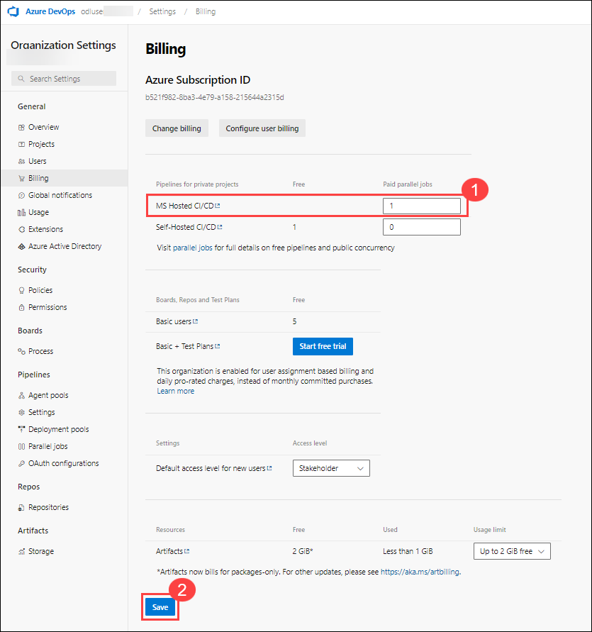

1. In the **Organization Settings** window, click on **Settings** in the left menu. On the settings page, enable the **Creation of Classic Release Pipeline** option.

   

1. On your lab computer, in a browser window open your Azure DevOps organization. Click on **New Project**. Give your project the name  **CICD (1)**, select visibility as **Private(2)**  and leave the other fields with defaults. Click on **Create project (3)**.

   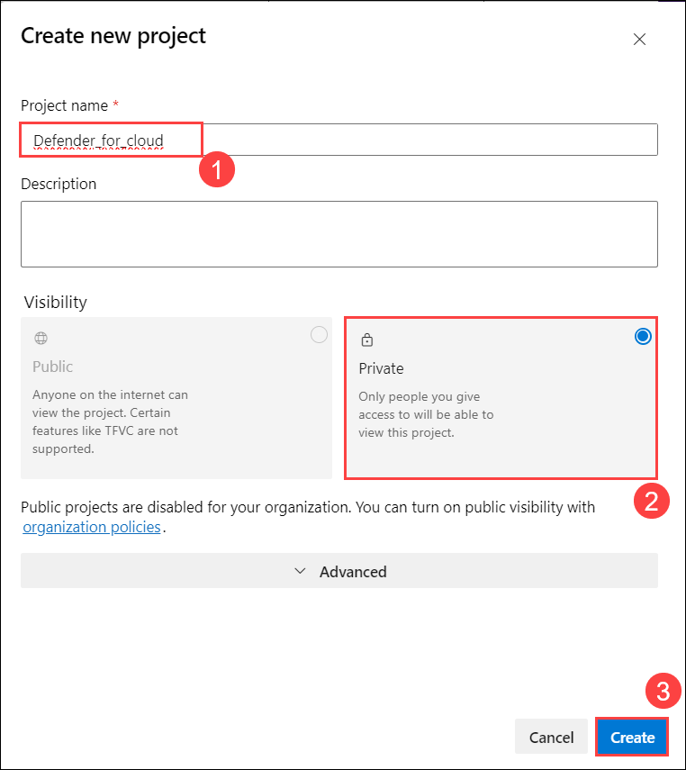
      
### 3. Create a Simple HTML File

1. Click on **Repos (1)>Files (2)**, Select **Initialize (3)**. 

   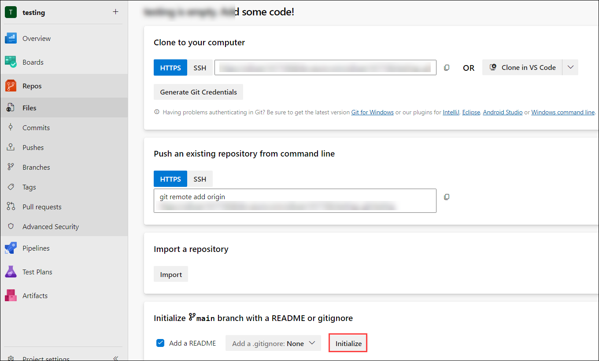

1. First, let’s create a basic HTML file named `index.html`:

   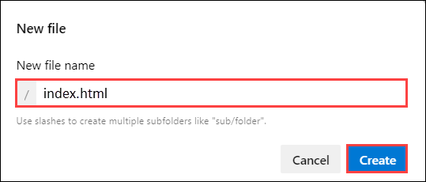

1. Add the following contnet to `index.html` file:

    ```html
    <!DOCTYPE html>
    <html>
    <head>
        <title>My Simple HTML Page</title>
    </head>
    <body>
        <h1>Hello, Azure DevOps!</h1>
        <p>This is a simple HTML page used to demonstrate CI/CD pipelines.</p>
    </body>
    </html>
    ```
1. Navigate back to the **Pipelines** pane in of the **Pipelines** hub.

1. In the **Create your first Pipeline** window, click **Create pipeline**.

   > **Note**: We will use the wizard to create a new YAML Pipeline definition based on our project.

1. On the **Where is your code?** pane, click **Azure Repos Git (YAML)** option.

   

1. On the **Select a repository** pane, click **CICD**.

   

1. On the **Configure your pipeline** pane, scroll down and select **Starter pipeline**.

   

1. Define your build pipeline in a file named `azure-pipelines.yml` with the following content:

   ```yaml
   trigger:
   - main

   pool:
   vmImage: 'ubuntu-latest'

   steps:
   - task: UsePythonVersion@0
   inputs:
      versionSpec: '3.x'
   displayName: 'Set up Python'

   - script: |
      echo "Building the HTML project..."
      mkdir output
      cp index.html output/
   displayName: 'Build Project'

   - task: PublishBuildArtifacts@1
   inputs:
      pathToPublish: 'output'
      artifactName: 'html-artifact'
   displayName: 'Publish Artifacts'

   ```
1. This YAML file does the following:
    - **Trigger**: Runs the pipeline when changes are pushed to the `main` branch.
    - **Pool**: Uses an Ubuntu VM image for the build.
    - **Steps**:
    - Set up Python (although not used in this case, you might need it for other tasks).
    - Create a directory called `output` and copy `index.html` to it.
    - Publish the contents of `output` as build artifacts.
   
8. Click **Save and Run** then click **Run** to start the Build Pipeline process.

   

9. Wait for the Build Pipeline to complete successfully.

    > **Note**: Each task from the YAML file is available for review, including any warnings and errors.

### 4. Create a Release Pipeline

1. Go to **Pipelines** > **Releases** > **New pipeline**.

   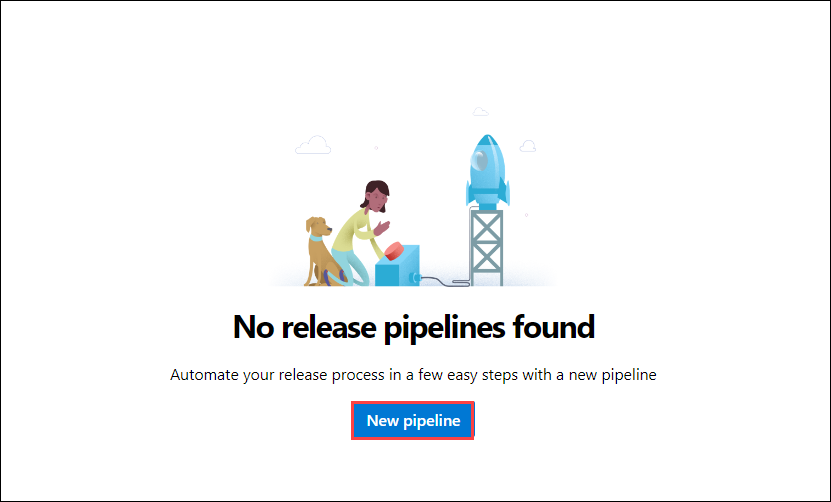

1. From the **Select a template** window, **choose** **Azure App Service Deployment** (Deploy your application to Azure App Service. Choose from Web App on Windows, Linux, containers, Function Apps, or WebJobs) under the **Featured** list of templates.    

1. Click **Apply**.

   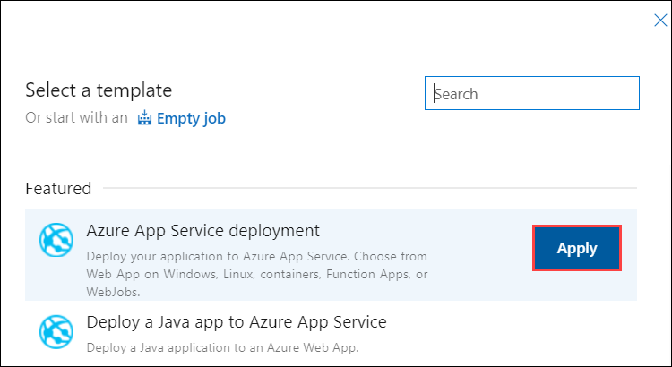

1. Select the **CICD (1)**  in the Source (build pipeline) field. Click **Add (2)** to confirm the selection of the artifact.

   

1. On the All pipelines > New Release Pipeline pane, ensure that the **stage 2** is selected. In the **Azure subscription(2)** dropdown list, Confirm the App Type is set to **Web App on Windows(3)**. Next, in the App Service name dropdown list, select the name of the **asclab-app (4)** web app.

   

   >**Note**: After Selecting your Azure subscription and click Authorize. If prompted, authenticate by using the user account with the Owner role in the Azure subscription

1. Select the Task **Deploy Azure App Service**. In the **Package or Folder** field, update the default value of "$(System.DefaultWorkingDirectory)/**/*.zip" to **"$(System.DefaultWorkingDirectory)/_CICD/html-artifact"**.

   

1.  On the **All pipelines > New Release Pipeline** pane, click **Save** and, in the **Save** dialog box, click **OK**.

    

1.  On the **All pipelines > New Release Pipeline** pane, click **Create release** .

    

1. Wait until the release pipline successfully completed.

   

1. Navigate to the Azure portal interface, navigate to the resource group **asclab**, in the list of resources, click the **asclab-app** web app.

1. On the web app blade, click **Browse**.

   

1. Verify that the web page loads successfully in a new web browser tab.

   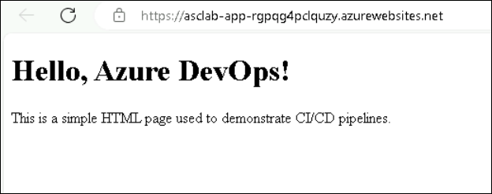

## Task 2: Identifying security issues in the pipeline 


1. On your lab computer, in the web browser window displaying the Azure DevOps portal with the **CICD** project open, click on the **marketplace icon > Browse Marketplace**.

   

2. On the MarketPlace, search for **Microsoft Security DevOps** and open it.

   

1.  On the **Microsoft Security DevOps** page, click on **Get it for free**.

    

1.  On the next page, select the desired Azure DevOps organization and **Install**.

    

1. Click **Proceed to organization** once installed.

   

1. Click on **Repos (1)>Files (2)**, create a new file named **main.tf** and add the following content to that file:

   ```hcl
   # Specify the provider
   provider "azurerm" {
   features {}
   }

   # Resource Group
   resource "azurerm_resource_group" "example" {
   name     = "example-resources"
   location = "East US"
   }

   # Virtual Network
   resource "azurerm_virtual_network" "example" {
   name                = "example-vnet"
   address_space       = ["10.0.0.0/16"]
   location            = azurerm_resource_group.example.location
   resource_group_name = azurerm_resource_group.example.name
   }

   # Subnet
   resource "azurerm_subnet" "example" {
   name                 = "example-subnet"
   resource_group_name  = azurerm_resource_group.example.name
   virtual_network_name = azurerm_virtual_network.example.name
   address_prefixes     = ["10.0.1.0/24"]
   }

   # Network Interface
   resource "azurerm_network_interface" "example" {
   name                = "example-nic"
   location            = azurerm_resource_group.example.location
   resource_group_name = azurerm_resource_group.example.name

   ip_configuration {
      name                          = "internal"
      subnet_id                     = azurerm_subnet.example.id
      private_ip_address_allocation = "Dynamic"
   }
   }

   # Virtual Machine
   resource "azurerm_virtual_machine" "example" {
   name                = "example-vm"
   location            = azurerm_resource_group.example.location
   resource_group_name = azurerm_resource_group.example.name
   network_interface_ids = [
      azurerm_network_interface.example.id,
   ]
   vm_size = "Standard_B1s"

   storage_os_disk {
      name              = "myosdisk1"
      caching           = "ReadWrite"
      create_option     = "FromImage"
      managed           = true
      disk_size_gb      = 30
   }

   storage_image_reference {
      publisher = "MicrosoftWindowsServer"
      offer     = "WindowsServer"
      sku       = "2019-Datacenter"
      version   = "latest"
   }

   os_profile {
      computer_name  = "hostname"
      admin_username = "adminuser"
      admin_password = "Password1234!"
   }

   os_profile_windows_config {
      provision_vm_agent = true
   }
   }
   ```

   ### Explanation:
   - **Provider Block**: Specifies the provider (in this case, Azure).
   - **Resource Group**: Defines the resource group where all other resources will reside.
   - **Virtual Network**: Defines a virtual network with a specified address space.
   - **Subnet**: Creates a subnet within the virtual network.
   - **Network Interface**: Creates a network interface card for the VM.
   - **Virtual Machine**: Defines the virtual machine including the operating system, size, and network settings.

1. on **Mian.tf** page, click on **Commit**.

   

1. Again click on **Commit**.

   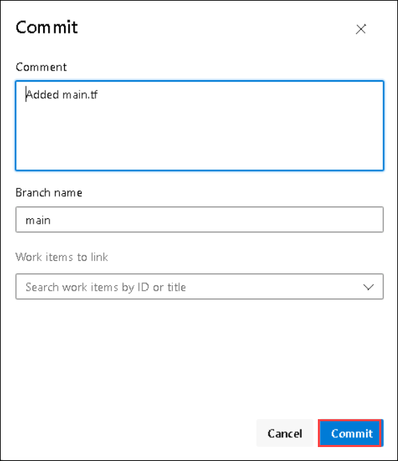

1. Navigate back to the **Pipelines** pane in of the **Pipelines** hub.

1. In the **Create your first Pipeline** window, click **Create pipeline**.

   > **Note**: We will use the wizard to create a new YAML Pipeline definition based on our project.

1. On the **Where is your code?** pane, click **Azure Repos Git (YAML)** option.

   

1. On the **Select a repository** pane, click **CICD**.

   

1. On the **Configure your pipeline** pane, scroll down and select **Starter pipeline**.

   

1. Define your build pipeline in a file named `azure-pipelines.yml` with the following content:

      ```yaml
      trigger: none
      pool:
      # ubuntu-latest also supported.
      vmImage: 'windows-latest'
      steps:
      - task: MicrosoftSecurityDevOps@1
      displayName: 'Microsoft Security DevOps'
      inputs:    
         categories: 'IaC'
      ```
1. This YAML file is designed to configure an Azure DevOps pipeline with the following specifics:

- **Trigger**: The pipeline is set to `none`, meaning it won't run automatically based on code changes or other triggers. It will need to be started manually or triggered by another pipeline or service.

- **Pool**: It specifies that the pipeline will use the `windows-latest` virtual machine image. This VM image is provided by Azure DevOps and ensures the pipeline runs on a fresh Windows environment with the latest updates.

- **Steps**: The pipeline includes a single step:
  - **Task**: It uses the `MicrosoftSecurityDevOps@1` task, which is designed for Microsoft Security DevOps.
  - **Display Name**: The task is labeled 'Microsoft Security DevOps' for easy identification in the pipeline UI.
  - **Inputs**:
    - `categories`: Set to 'IaC', indicating that the task will focus on Infrastructure as Code (IaC) security scanning.
    
8. Click **Save and Run** then click **Run** to start the Build Pipeline process.

   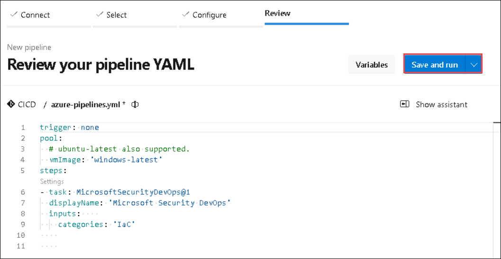

9. Wait for the build pipeline to complete. Once finished, review the results, including any warnings or errors reported by the tasks. Address any issues identified, make the necessary changes, and then rerun the pipeline to ensure that all problems are resolved.
   
   

By setting up this pipeline, you've integrated a security task that scans IaC configurations within Azure DevOps. This ensures that security issues in your IaC templates are identified early in the development process, enhancing overall security posture and compliance.

## Task 3: Overview of GitHub Advanced Security (GHAS) [Read-Only] 

### Overview of GitHub Advanced Security (GHAS)

GitHub Advanced Security (GHAS) is a suite of security tools built into the GitHub platform designed to help developers secure their code and workflows. It includes features such as code scanning, secret scanning, and dependency review to identify and remediate security vulnerabilities and exposures.

 1. Enable GitHub Advanced Security
To use GHAS, you need to have GitHub Advanced Security enabled for your repository. This typically requires a GitHub Enterprise subscription.

- Navigate to your repository on GitHub.
- Click on `Settings`.
- In the `Security` section, find `GitHub Advanced Security` and enable it.

 2. Configure Code Scanning

**Code scanning** helps detect vulnerabilities and errors in your code by running static analysis tools.

- Go to the `Security` tab of your repository.
- Click on `Set up code scanning`.
- You can choose from different options like `CodeQL Analysis`, which is a powerful tool provided by GitHub. Select the `Set up this workflow` button for `CodeQL Analysis`.
- Review the configuration file (e.g., `.github/workflows/codeql-analysis.yml`). Modify it if needed and commit it to your repository.

 3. Run Code Scanning

- Once configured, code scanning runs automatically on the specified events (like pushes and pull requests).
- You can also manually trigger a scan by going to the `Actions` tab, finding the `CodeQL` workflow, and clicking `Run workflow`.

 4. Review Code Scanning Results

- Navigate to the `Security` tab, and under `Code scanning alerts`, you'll see a list of detected issues.
- Click on any alert to get detailed information about the vulnerability and recommended fixes.

 5. Configure Secret Scanning

**Secret scanning** detects secrets (like API keys and tokens) that may have been accidentally committed to your repository.

- Go to the `Security` tab of your repository.
- Click on `Set up secret scanning`.
- GitHub automatically scans for patterns that match common secret types and alerts you if any are found.

 6. Review Secret Scanning Results

- Navigate to the `Security` tab, and under `Secret scanning alerts`, you'll see a list of detected secrets.
- Click on any alert to view details and follow the steps to revoke or rotate the compromised secrets.

 7. Set Up Dependency Review

**Dependency review** helps you understand and remediate vulnerable dependencies in your project.

- Ensure your project has a dependency manifest file (e.g., `package.json`, `pom.xml`).
- GitHub automatically generates dependency graphs and checks for known vulnerabilities in your dependencies.

 8. Review Dependency Alerts

- Navigate to the `Security` tab, and under `Dependency review`, you'll see alerts for vulnerable dependencies.
- Click on any alert to see details about the vulnerability and recommended versions to update to.

 9. Manage Security Policies

- In the `Security` tab, you can also manage security policies by setting up a `security.md` file to inform users about your project's security practices and how they can report vulnerabilities.

 10. Continuous Monitoring and Alerts

- GitHub Advanced Security continuously monitors your repository and generates alerts for any new issues found.
- Make it a habit to regularly review the `Security` tab and address any new alerts promptly.

## Task 4: Overview of Defender for DevOps (including pricing) [Read-Only] 

#Defender for DevOps is a security solution by Microsoft designed to enhance the security of DevOps environments. It provides a range of tools and features to help secure the software development lifecycle (SDLC) and protect against threats that target DevOps processes. Here's an overview:

### Key Features:

1. Security for CI/CD Pipelines:

   - **Code Scanning:** Identifies vulnerabilities and security issues in your code before deployment.
   - **Dependency Scanning:** Detects known vulnerabilities in dependencies and libraries used in your projects.

2. Integration with Azure DevOps and GitHub:
   - **Azure DevOps:** Integrates with Azure Pipelines, Boards, Repos, and other Azure DevOps services to secure the DevOps lifecycle.
   - **GitHub:** Provides security insights and recommendations directly in your GitHub repositories.

3. Container Security:
   - **Image Scanning:** Scans container images for vulnerabilities before they are deployed.
   - **Runtime Protection:** Monitors running containers for security issues and potential threats.

4. Infrastructure as Code (IaC) Security:
   - **IaC Scanning:** Analyzes your IaC templates for security misconfigurations and vulnerabilities.

5. Policy Management:
   - **Compliance Policies:** Enforces security policies and compliance requirements across your DevOps processes.

6. Threat Detection and Response:
   - **Alerts and Notifications:** Provides real-time alerts on detected security threats and vulnerabilities.
   - **Incident Management:** Helps manage and respond to security incidents effectively.

### Pricing:

Defender for DevOps is included in Microsoft Defender for Cloud, and its pricing is generally based on the overall Defender for Cloud plan. Pricing may vary based on:

1. Number of Resources:
   - The cost may be influenced by the number of resources (e.g., pipelines, repositories, containers) being protected.

2. Features and Plans:
   - Microsoft Defender for Cloud offers different pricing tiers (e.g., Free, Standard, and Enhanced) that include various features and levels of protection. Defender for DevOps features are generally available in the Standard or Enhanced tiers.

3. Azure Consumption:
   - Costs are also related to the overall consumption of Azure resources and services.

For the most accurate and up-to-date pricing, it's best to consult the [Microsoft Defender for Cloud pricing page](https://azure.microsoft.com/en-us/pricing/details/defender-for-cloud/) or contact Microsoft sales support directly.

## Task 5: Securing your pipeline with GHAS 

To secure your pipeline with GitHub Advanced Security (GHAS) and Microsoft Defender for DevOps, you can integrate these tools to enhance your pipeline's security posture. Here’s a example of how to use GHAS and Defender for DevOps for security:

### 1. GitHub Advanced Security (GHAS)

**GitHub Advanced Security** provides several features to secure your code, including code scanning, secret scanning, and dependency review.

1. Copy the link and open it in a browser window to log in to GitHub.

   ```
   https://github.com/login
   ```

2. In the sign-in to GitHub page in the Edge browser, enter the **GitHub UserEmail** and **GitHub Password** and click on **Sign in**.

      >**Note:** Use your personal GitHub account to perform this task. If you don't have a GitHub account, create a new one by following the instructions in this [Microsoft document](https://docs.microsoft.com/en-us/github/get-started/sign-up-for-github).

1. Navigate to `https://github.com/ghas-bootcamp/ghas-bootcamp/fork` and click on **Create fork**

1. In the GitHub repository navigate to **Settings** from the top navigation pane and click on **Code Security and Analysis** under Security.

1. Scroll down and you will find the **Code Scanning** option.Click on **Set up code scanning**.

   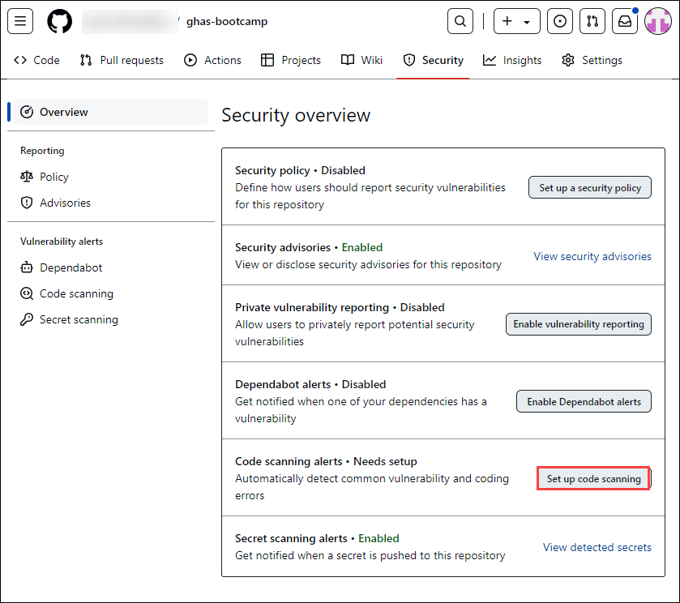

1. Now, Click on the **Setup** button and click on **Advanced**.

   

1. Now you are redirect you to the codeql.yml file in github/ workflows, review the yml file and then click on **commit changes**. 

   

1. Again, click on **Commit changes**.

   

1. Navigate, to **actions** tab and wait until shows a successful run of a GitHub Actions workflow.

   

1. In the repository navigate to **Settings** from the top navigation pane, Scroll down to **Secret Scanning** and ensure that **Secret Scanning** is enabled.

   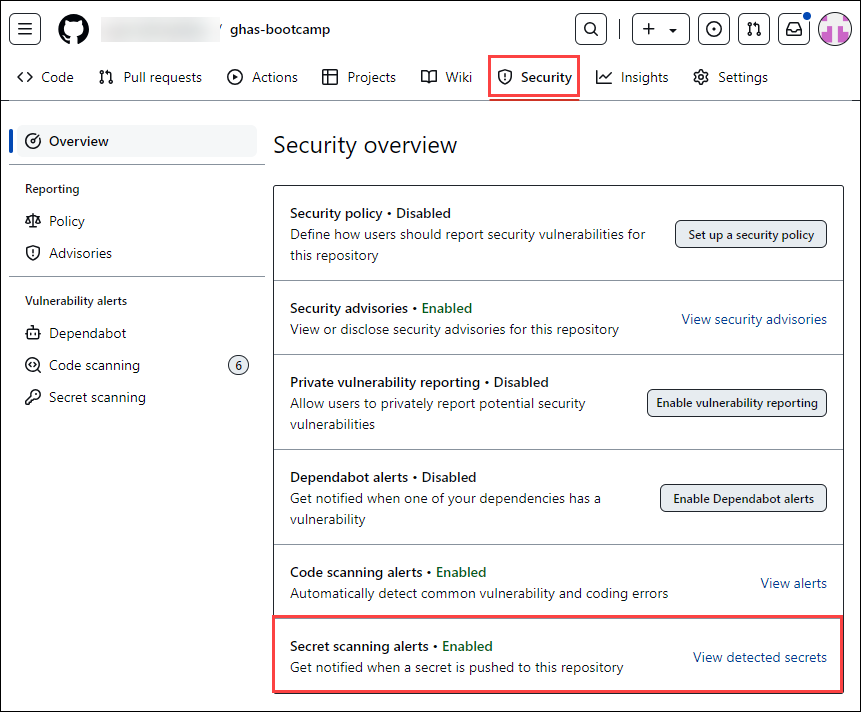

1. Go to **Security** and scroll down to **Dependabot alerts** and enable **Dependabot** for automated dependency updates and reviews.

   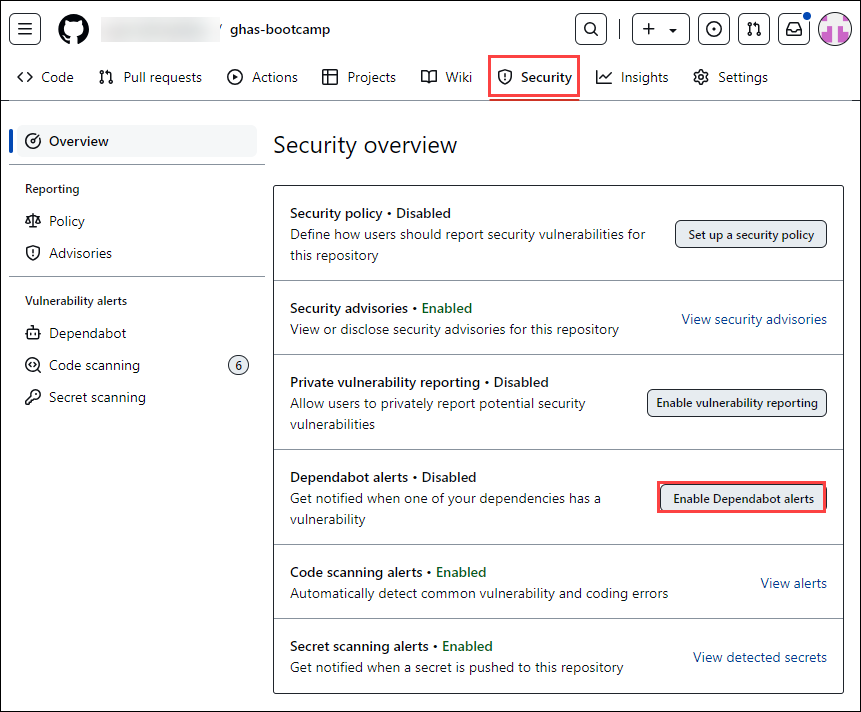

1. **Code Scanning** is enabled with CodeQL for identifying code vulnerabilities, while **Secret Scanning** and **Dependency Review** are managed through GitHub’s settings.

1. Integrating GHAS enhances your pipeline’s protection against security threats and vulnerabilities.

## Task 6: Connecting and Securing your Azure DevOps environment to MDC 

1. Search and select **Microsoft Defender for Cloud** from the portal

   

1. Select **skip** on **Getting started** tab.

   

1. Select **Environment settings** under Management > **+Add environment** > **Azure DevOps**

   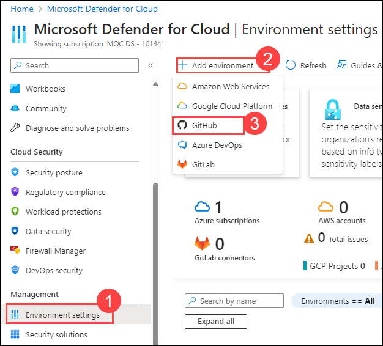

1. On the **Azure DevOps Connection** page, under **Account details**, provide the below settings.

   | Setting  | Value |
   -----------|---------
   | Connector name | AzureDevopsconnector |
   | Subscription | Choose the default subscription |
   | Resource group | Lab-VM |
   | Location | Select any supporting region |

   

1. Select **Next: Configure access**

1. Select **Authorize**. Ensure you're authorizing the correct Azure Tenant using the drop-down menu in Azure DevOps and by verifying you're in the correct Azure Tenant in Defender for Cloud.

1. In the popup dialog, read the list of permission requests, and then select **Accept**.

   

1. Leave all other settings as default.

1. Select **Next: Review and generate**.

1. Review the information, and then select **Create**.

1. Wait for some time to view the connector on the **Environment settings** page.

1. Navigate to **DevOps Security** under **Cloud Security**.

   

1. The **DevOps security findings** and **DevOps security results** are listed on the page, which helps to review the DevOps security posture.

   

   >**Note:** It might take upto 8hrs to reflect the real-time status.

1. Navigate to **DevOps workbook** and change the toggle to **Yes**, which provides an overview of the tabs provided below

   

   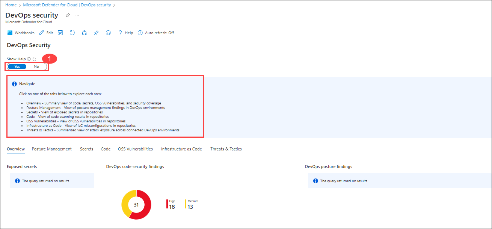

1. Navigate to the **Code** tab and scroll down, click on the **Severity** section to open the individual findings, and click on **Information** which in turn provides detailed findings and the issue location.

   

1. Similarly, navigate to the **OSS Vulnerabilities** tab and identify the issues, then take note of the recommendations provided to resolve the issues.

   

## Task 7: Integrating non-MS security scan solutions with MDC 

Integrating non-Microsoft security scan solutions with Microsoft Defender for Cloud (MDC) can provide a more comprehensive security posture. 

### **1. Create an Azure DevOps Repository**

1. **Log In to Azure DevOps**:
   - Go to [Azure DevOps](https://dev.azure.com/) and sign in to your account.

2. **Navigate to Your Project**:
   - Select your project or create a new one.

3. **Create a New Repository**:
   - Go to `Repos` in the left-hand menu.
   - Click on `Files` (if not already selected).
   - Click on `New repository` (or `New` if you already have repositories listed).
   - Provide a name for your repository (e.g., `iac-templates`).
   - Choose the type of repository (e.g., Git).
   - Click `Create`.

### **2. Add IaC Templates to Your Repository**

#### **Example IaC Templates**

**Terraform Example (`main.tf`)**:
```hcl
# main.tf
provider "aws" {
  region = "us-west-2"
}

resource "aws_s3_bucket" "bucket" {
  bucket = "my-example-bucket"
  acl    = "private"
}
```

**ARM Template Example (`template.json`)**:
```json
{
  "$schema": "https://schema.management.azure.com/2020-06-01/deploymentTemplate.json#",
  "contentVersion": "1.0.0.0",
  "resources": [
    {
      "type": "Microsoft.Storage/storageAccounts",
      "apiVersion": "2021-04-01",
      "name": "mystorageaccount",
      "location": "eastus",
      "sku": {
        "name": "Standard_LRS"
      },
      "kind": "StorageV2",
      "properties": {
        "accessTier": "Hot"
      }
    }
  ]
}
```

1. **Clone the Repository Locally**:
   - Copy the clone URL from Azure DevOps.
   - Open a terminal or command prompt and run:

     ```bash
     git clone <your-repo-url>
     cd <your-repo-name>
     ```

2. **Add Your IaC Templates**:
   - Place your `main.tf` or `template.json` files in the cloned repository directory.

3. **Commit and Push Changes**:

   ```bash
   git add main.tf # or template.json
   git commit -m "Add IaC templates"
   git push origin main
   ```

### **3. Verify Your IaC Templates**

1. **Check Repository in Azure DevOps**:
   - Go back to your Azure DevOps project.
   - Navigate to `Repos` > `Files`.
   - Verify that your IaC templates (e.g., `main.tf`, `template.json`) are listed.

### **4. Set Up a Pipeline to Scan IaC Templates**

Here’s a basic pipeline YAML configuration to scan these IaC templates. This example uses Terraform:

```yaml
trigger:
- main

pool:
  vmImage: 'ubuntu-latest'

steps:
- script: |
    echo "Installing Terraform..."
    sudo apt-get update
    sudo apt-get install -y wget unzip
    wget https://releases.hashicorp.com/terraform/1.4.0/terraform_1.4.0_linux_amd64.zip
    unzip terraform_1.4.0_linux_amd64.zip
    sudo mv terraform /usr/local/bin/

    echo "Running Terraform scan..."
    tflint --config .tflint.hcl
  displayName: 'Install Terraform and Run tflint'
```

### **Summary**

- **Create a Repository**: Set up a new Git repository in Azure DevOps.
- **Add IaC Templates**: Commit your IaC templates (Terraform, ARM, etc.) to the repository.
- **Set Up a Pipeline**: Configure a pipeline to scan your IaC templates.

This setup allows you to store and manage your IaC templates in Azure DevOps and integrate them into your CI/CD pipelines for automated validation and security scanning.


## Task 8: Role of Defender Cloud Security Posture Management (DCSPM) 

