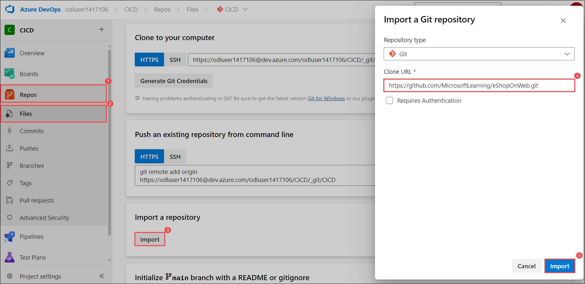
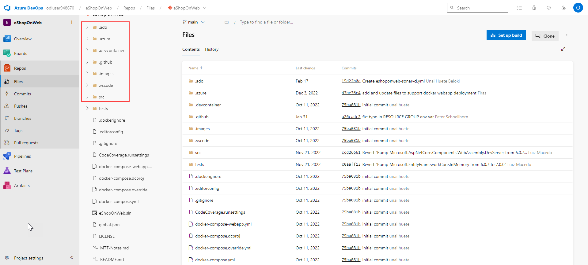
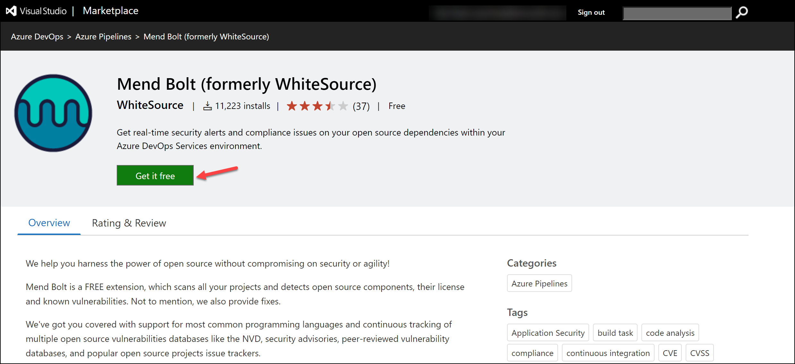
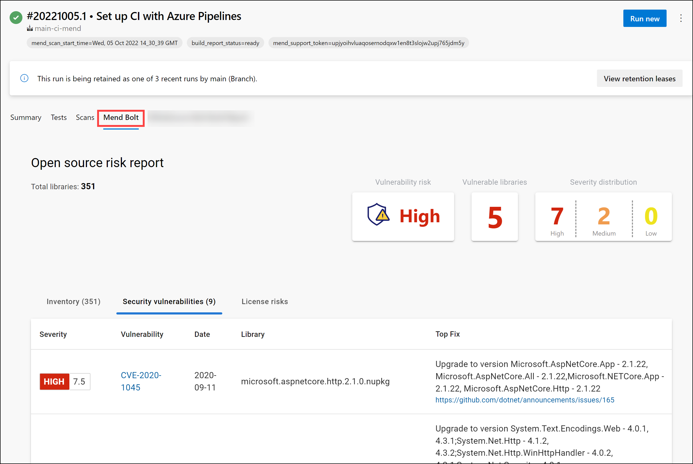
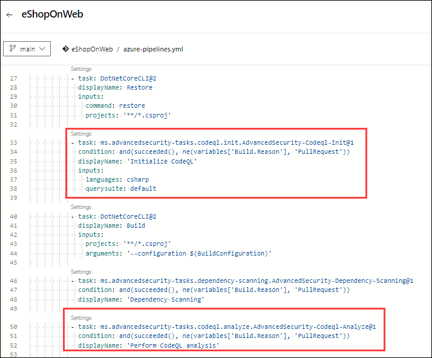
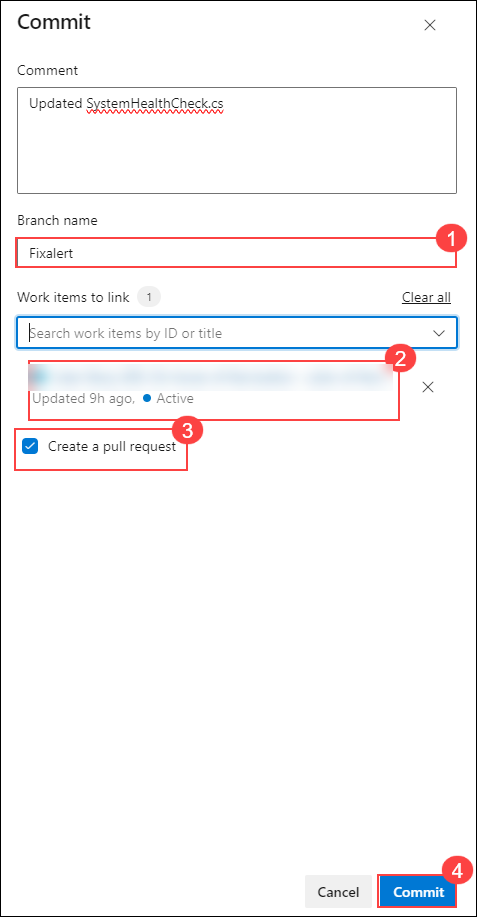
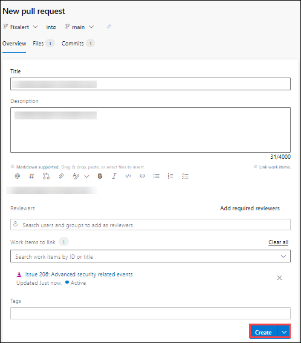
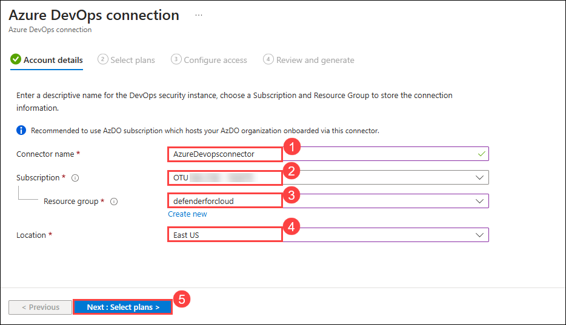
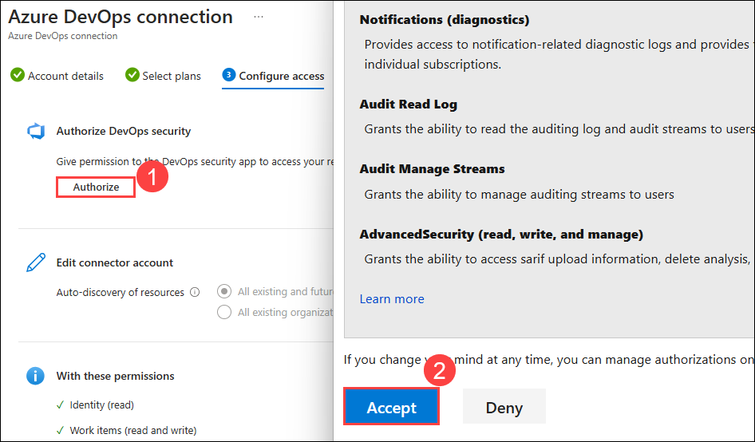
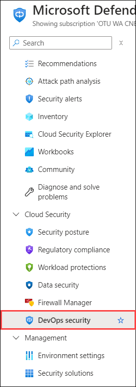

## Module 5 – Defender for DevOps 

## Exercise 1: Understanding CI/CD pipelines in Azure DevOps 

### Task 1:  Set up an Azure DevOps organization.

1. On your lab VM open **Edge Browser** on desktop and navigate to [Azure DevOps](https://go.microsoft.com/fwlink/?LinkId=307137), and if prompted sign with the credentials.

    * Email/Username: <inject key="AzureAdUserEmail"></inject>

    * Password: <inject key="AzureAdUserPassword"></inject>

2. If prompted click **Ask later** on **Action Required** page.

3. On the next page accept defaults and click on continue.
   
   
   
4. On the **Almost Done...** page fill the captcha and click on continue. 

   
    
5. On the Azure DevOps page click on **Azure DevOps** located at top left corner and then click on **Organization Setting** at the left down corner

    .png)
    
6. In the **Organization Setting** window on the left menu click on **Billing (1)** and select **Setup Billing (2)** then click on **save (3)**.

    

        

7. On the **MS Hosted CI/CD (1)** section under **Paid parallel jobs** enter value **1** and at the end of the page click on **Save (2)**.

    

8. In the **Organization Setting** window on the left menu click on **Policies** and enable **Third-party application access via OAuth**.

    

1. On your lab computer, in a browser window open your Azure DevOps organization. Click on **New Project**. Give your project the name  **eShopOnWeb (1)**, select visibility as **Private(2)**  and leave the other fields with defaults. Click on **Create project (3)**.

      
      
1. Click on **Repos (1)>Files (2) , Import a Repository**. Select **Import (3)**. On the **Import a Git Repository (4)** window, paste the following URL https://github.com/MicrosoftLearning/eShopOnWeb.git (5) and click **Import (6)**.

      
      
      

2. The repository is organized the following way:

      o. **.ado** folder contains Azure DevOps YAML pipelines
         
      o **.devcontainer** folder container setup to develop using containers (either locally in VS Code or GitHub Codespaces)
         
      o **.azure** folder contains Bicep & ARM infrastructure as code templates used in some lab scenarios.
         
      o **.github** folder contains YAML GitHub workflow definitions.
         
      o. **src** folder contains the .NET 6 website used in the lab scenarios.
         
      
         
### Task 2: Create Azure resources

In this task, you will create an Azure web app by using the Azure portal.

1. From the lab computer, start a web browser, navigate to the [**Azure Portal**](https://portal.azure.com), and sign in with the user account that has the Owner role in the Azure subscription you will be using in this lab and has the role of the Global Administrator in the Azure AD tenant associated with this subscription.

1. In the Azure portal, in the toolbar, click the **Cloud Shell** icon located directly to the right of the search text box.
1. If prompted to select either **Bash** or **PowerShell**, select **Bash**.

    >**Note**: If this is the first time you are starting **Cloud Shell** and you are presented with the **You have no storage mounted** message, select the subscription you are using in this lab, and select **Create storage**.

    > **Note:** for a list of regions and their alias, run the following command from the Azure Cloud Shell - Bash:

    ```bash
    az account list-locations -o table
    ```

1. From the **Bash** prompt, in the **Cloud Shell** pane, run the following command to create a resource group (replace the `<region>` placeholder with the name of the Azure region closest to you such as 'centralus', 'westeurope' or other region of choice).

    ```bash
    LOCATION='<region>'
    ```

    ```bash
    RESOURCEGROUPNAME='az400m05l11-RG'
    az group create --name $RESOURCEGROUPNAME --location $LOCATION
    ```

1. To create a Windows App service plan by running the following command:

    ```bash
    SERVICEPLANNAME='az400m05l11-sp1'
    az appservice plan create --resource-group $RESOURCEGROUPNAME --name $SERVICEPLANNAME --sku B3
    ```

1. Create a web app with a unique name.

    ```bash
    WEBAPPNAME=eshoponWebYAML$RANDOM$RANDOM
    az webapp create --resource-group $RESOURCEGROUPNAME --plan $SERVICEPLANNAME --name $WEBAPPNAME
    ```

    > **Note**: Record the name of the web app. You will need it later in this lab.

1. Close the Azure Cloud Shell, but leave the Azure Portal open in the browser.

### Task 3: Configure CI/CD Pipelines as Code with YAML in Azure DevOps

1. Navigate back to the **Pipelines** pane in of the **Pipelines** hub.
1. In the **Create your first Pipeline** window, click **Create pipeline**.

    > **Note**: We will use the wizard to create a new YAML Pipeline definition based on our project.

1. On the **Where is your code?** pane, click **Azure Repos Git (YAML)** option.

1. On the **Select a repository** pane, click **eShopOnWeb_MultiStageYAML**.

1. On the **Configure your pipeline** pane, scroll down and select **Existing Azure Pipelines YAML File**.

1. In the **Selecting an existing YAML File** blade, specify the following parameters:
- Branch: **main**
- Path: **.ado/eshoponweb-ci.yml**

7. Click **Continue** to save these settings.

8. From the **Review your Pipeline YAML** screen, click **Run** to start the Build Pipeline process.
9. Wait for the Build Pipeline to complete successfully. Ignore any warnings regarding the source code itself, as they are not relevant for this lab exercise.

    > **Note**: Each task from the YAML file is available for review, including any warnings and errors.

### Task 4: Add continuous delivery to the YAML definition

In this task, you will add continuous delivery to the YAML-based definition of the pipeline you created in the previous task.

  > **Note**: Now that the build and test processes are successful, we can now add delivery to the YAML definition.

1. On the pipeline run pane, click the ellipsis symbol in the upper right corner and, in the dropdown menu, click **Edit pipeline**.

1. On the pane displaying the content of the **eShopOnWeb_MultiStageYAML/.ado/eshoponweb-ci.yml** file, navigate to the end of the file (line 56), and hit **Enter/Return** to add a new empty line.

1. Being on line **57**, add the following content to define the **Release** stage in the YAML pipeline.

    > **Note**: You can define whatever stages you need to better organize and track pipeline progress.

    ```yaml
    - stage: Deploy
      displayName: Deploy to an Azure Web App
      jobs:
      - job: Deploy
        pool:
          vmImage: 'windows-2019'
        steps:
    ```

1. Set the cursor on a new line at the end of the YAML definition.

    > **Note**: This will be the location where new tasks are added.

1. In the list of tasks on the right side of the code pane, search for and select the **Azure App Service Deploy** task.

1. In the **Azure App Service deploy** pane, specify the following settings and click **Add**:

    - in the **Azure subscription** drop-down list, select the Azure subscription into which you deployed the Azure resources earlier in the lab, click **Authorize**, and, when prompted, authenticate by using the same user account you used during the Azure resource deployment.
    - in the **App Service name** dropdown list, select the name of the web app you deployed earlier in the lab.
    - in the **Package or folder** text box, **update** the Default Value to `$(Build.ArtifactStagingDirectory)/**/Web.zip`.
1. Confirm the settings from the Assistant pane by clicking the **Add** button.

    > **Note**: This will automatically add the deployment task to the YAML pipeline definition.

1. The snippet of code added to the editor should look similar to below, reflecting your name for the azureSubscription and WebappName parameters:

    ```yaml
        - task: AzureRmWebAppDeployment@4
          inputs:
            ConnectionType: 'AzureRM'
            azureSubscription: 'AZURE SUBSCRIPTION HERE (b999999abc-1234-987a-a1e0-27fb2ea7f9f4)'
            appType: 'webApp'
            WebAppName: 'eshoponWebYAML369825031'
            packageForLinux: '$(Build.ArtifactStagingDirectory)/**/Web.zip'
    ```

1. Validate the task is listed as a child of the **steps** task. If not, select all lines from the added task, press the **Tab** key twice to indent it four spaces, so that it listed as a child of the **steps** task.

    > **Note**: The **packageForLinux** parameter is misleading in the context of this lab, but it is valid for Windows or Linux.

    > **Note**: By default, these two stages run independently. As a result, the build output from the first stage might not be available to the second stage without additional changes. To implement these changes, we will add a new task to download the deployment artifact in the beginning of the deploy stage.

1. Place the cursor on the first line under the **steps** node of the **deploy** stage, and hit Enter/Return to add a new empty line (Line 64).

1. On the **Tasks** pane, search for and select the **Download build artifacts** task.

1. Specify the following parameters for this task:
    - Download Artifacts produced by: **Current Build**
    - Download Type: **Specific Artifact**
    - Artifact Name: **Enter "Website" in the text box**
    - Destination Directory: **$(Build.ArtifactStagingDirectory)**

1. Click **Add**.

1. The snippet of added code should look similar to below:

    ```yaml
        - task: DownloadBuildArtifacts@0
          inputs:
            buildType: 'current'
            downloadType: 'single'
            artifactName: 'Website'
            downloadPath: '$(Build.ArtifactStagingDirectory)'
    ```
1. If the YAML indentation is off, With the added task still selected in the editor, press the **Tab** key twice to indent it four spaces.

    > **Note**: Here as well you may also want to add an empty line before and after to make it easier to read.

1. Click **Save**, on the **Save** pane, click **Save** again to commit the change directly into the master branch.

    > **Note**: Since our original CI-YAML was not configured to automatically trigger a new build, we have to initiate this one manually.

1. From the Azure DevOps left menu, navigate to **Pipelines** and select **Pipelines** again. 

1. Open the **EShopOnWeb_MultiStageYAML** Pipeline and click **Run Pipeline**.

1. Confirm the **Run** from the appearing pane.

1. Notice the 2 different Stages, **Build .Net Core Solution** and **Deploy to Azure Web App** appearing.

1. Wait for the pipeline to kick off and wait until it completes the Build Stage successfully.

1. Once the Deploy Stage wants to start, you are prompted with **Permissions Needed**, as well as an orange bar saying 
    ```
    This pipeline needs permission to access a resource before this run can continue to Deploy to an Azure Web App
    ```
1. Click on **View**

1. From the **Waiting for Review** pane, click **Permit**.

1. Validate the message in the **Permit popup** window, and confirm by clicking **Permit**.

1. This sets off the Deploy Stage. Wait for this to complete successfully.

     > **Note**: If the deployment should fail, because of an issue with the YAML Pipeline syntax, use this as a reference:

     ```yaml
    #NAME THE PIPELINE SAME AS FILE (WITHOUT ".yml")
    # trigger:
    # - main

    resources:
      repositories:
        - repository: self
          trigger: none

    stages:
    - stage: Build
      displayName: Build .Net Core Solution
      jobs:
      - job: Build
        pool:
          vmImage: ubuntu-latest
        steps:
        - task: DotNetCoreCLI@2
          displayName: Restore
          inputs:
            command: 'restore'
            projects: '**/*.sln'
            feedsToUse: 'select'

        - task: DotNetCoreCLI@2
          displayName: Build
          inputs:
            command: 'build'
            projects: '**/*.sln'

        - task: DotNetCoreCLI@2
          displayName: Test
          inputs:
            command: 'test'
            projects: 'tests/UnitTests/*.csproj'

        - task: DotNetCoreCLI@2
          displayName: Publish
          inputs:
            command: 'publish'
            publishWebProjects: true
            arguments: '-o $(Build.ArtifactStagingDirectory)'

        - task: PublishBuildArtifacts@1
          displayName: Publish Artifacts ADO - Website
          inputs:
            pathToPublish: '$(Build.ArtifactStagingDirectory)'
            artifactName: Website

        - task: PublishBuildArtifacts@1
          displayName: Publish Artifacts ADO - Bicep
          inputs:
            PathtoPublish: '$(Build.SourcesDirectory)/.azure/bicep/webapp.bicep'
            ArtifactName: 'Bicep'
            publishLocation: 'Container'

    - stage: Deploy
      displayName: Deploy to an Azure Web App
      jobs:
      - job: Deploy
        pool:
          vmImage: 'windows-2019'
        steps:
        - task: DownloadBuildArtifacts@0
          inputs:
            buildType: 'current'
            downloadType: 'single'
            artifactName: 'Website'
            downloadPath: '$(Build.ArtifactStagingDirectory)'
        - task: AzureRmWebAppDeployment@4
          inputs:
            ConnectionType: 'AzureRM'
            azureSubscription: 'AZURE SUBSCRIPTION HERE (b999999abc-1234-987a-a1e0-27fb2ea7f9f4)'
            appType: 'webApp'
            WebAppName: 'eshoponWebYAML369825031'
            packageForLinux: '$(Build.ArtifactStagingDirectory)/**/Web.zip'

    ```

### Task 5: Review the deployed site

1. Switch back to web browser window displaying the Azure portal and navigate to the blade displaying the properties of the Azure web app.

1. On the Azure web app blade, click **Overview** and, on the overview blade, click **Browse** to open your site in a new web browser tab.

1. Verify that the deployed site loads as expected in the new browser tab, showing the EShopOnWeb E-commerce website.
  
## Exercise 2: Identifying security issues in the pipeline 

#### Task 1: Activate Mend Bolt extension

In this task, you will activate WhiteSource Bolt in the newly generated Azure Devops project.

1.  On your lab computer, in the web browser window displaying the Azure DevOps portal with the **eShopOnWeb** project open, click on the marketplace icon > **Browse Marketplace**.

    

1.  On the MarketPlace, search for **Mend Bolt (formerly WhiteSource)** and open it. Mend Bolt is the free version of the previously known WhiteSource tool, which scans all your projects and detects open source components, their license and known vulnerabilities.

    > Warning: make sure you select the Mend **Bolt** option (the **free** one)!

1.  On the **Mend Bolt (formerly WhiteSource)** page, click on **Get it for free**.

    

1.  On the next page, select the desired Azure DevOps organization and **Install**. **Proceed to organization** once installed.

1.  In your Azure DevOps navigate to **Organization Settings** and select **Mend** under **Extensions**. Provide your Work Email (**your lab personal account**, e.g. using AZ400learner@outlook.com instead of student@microsoft.com ), Company Name and other details and click **Create Account** button to start using the Free version.

    


#### Task 2: Create and Trigger a build

In this task, you will create and trigger a CI build pipeline within  Azure DevOps project. You will use **Mend Bolt** extension to identify vulnerable OSS components present in this code.

1.  On your lab computer, from the **eShopOnWeb** Azure DevOps project, in the vertical menu bar on the left side, navigate to the **Pipelines>Pipelines** section, click **Create Pipeline** (or **New Pipeline**).

1.  On the **Where is your code?** window, select **Azure Repos Git (YAML)** and select the **eShopOnWeb** repository.

1.  On the **Configure** section, choose **Existing Azure Pipelines YAML file (1)**. Provide the following **path (2)** **/.ado/eshoponweb-ci-mend.yml** and click **Continue (3)**.

    

1.  Review the pipeline and click on **Run**. It will take a few minutes to run successfully.
    > **Note**: The build may take a few minutes to complete. The build definition consists of the following tasks:
    - **DotnetCLI** task for restoring, building, testing and publishing the dotnet project.
    - **Whitesource** task (still keeps the old name), to run the Mend tool analysis of OSS libraries.
    - **Publish Artifacts** the agents running this pipeline will upload the published web project.

1.  While the pipeline is executing, lets **rename** it to identify it easier (as the project may be used for multiple labs). Go to **Pipelines/Pipelines** section in Azure DevOps project, click on the executing Pipeline name (it will get a default name), and look for **Rename/move** option on the ellipsis icon. Rename it to **eshoponweb-ci-mend** and click **Save**.

    

1.  Once the pipeline execution has finished, you can review the results. Open the latest execution for  **eshoponweb-ci-mend** pipeline. The summary tab will show the logs of the execution, together with related details such as the repository version(commit) used, trigger type, published artifacts, test coverage, etc.

1. On the **Mend Bolt** tab, you can review the OSS security analysis. It will show you details around the inventory used, vulnerabilities found (and how to solve them), and an interesting report around library related Licenses. Take some time to review the report.

    

## Exercise 3: Overview of GitHub Advanced Security (GHAS) [Read-Only] 

### Overview of GitHub Advanced Security (GHAS)

GitHub Advanced Security (GHAS) is a suite of security tools built into the GitHub platform designed to help developers secure their code and workflows. It includes features such as code scanning, secret scanning, and dependency review to identify and remediate security vulnerabilities and exposures.

### Step-by-Step Guide to GitHub Advanced Security

#### 1. **Enable GitHub Advanced Security**
To use GHAS, you need to have GitHub Advanced Security enabled for your repository. This typically requires a GitHub Enterprise subscription.

- Navigate to your repository on GitHub.
- Click on `Settings`.
- In the `Security` section, find `GitHub Advanced Security` and enable it.

#### 2. **Configure Code Scanning**

**Code scanning** helps detect vulnerabilities and errors in your code by running static analysis tools.

- Go to the `Security` tab of your repository.
- Click on `Set up code scanning`.
- You can choose from different options like `CodeQL Analysis`, which is a powerful tool provided by GitHub. Select the `Set up this workflow` button for `CodeQL Analysis`.
- Review the configuration file (e.g., `.github/workflows/codeql-analysis.yml`). Modify it if needed and commit it to your repository.

#### 3. **Run Code Scanning**

- Once configured, code scanning runs automatically on the specified events (like pushes and pull requests).
- You can also manually trigger a scan by going to the `Actions` tab, finding the `CodeQL` workflow, and clicking `Run workflow`.

#### 4. **Review Code Scanning Results**

- Navigate to the `Security` tab, and under `Code scanning alerts`, you'll see a list of detected issues.
- Click on any alert to get detailed information about the vulnerability and recommended fixes.

#### 5. **Configure Secret Scanning**

**Secret scanning** detects secrets (like API keys and tokens) that may have been accidentally committed to your repository.

- Go to the `Security` tab of your repository.
- Click on `Set up secret scanning`.
- GitHub automatically scans for patterns that match common secret types and alerts you if any are found.

#### 6. **Review Secret Scanning Results**

- Navigate to the `Security` tab, and under `Secret scanning alerts`, you'll see a list of detected secrets.
- Click on any alert to view details and follow the steps to revoke or rotate the compromised secrets.

#### 7. **Set Up Dependency Review**

**Dependency review** helps you understand and remediate vulnerable dependencies in your project.

- Ensure your project has a dependency manifest file (e.g., `package.json`, `pom.xml`).
- GitHub automatically generates dependency graphs and checks for known vulnerabilities in your dependencies.

#### 8. **Review Dependency Alerts**

- Navigate to the `Security` tab, and under `Dependency review`, you'll see alerts for vulnerable dependencies.
- Click on any alert to see details about the vulnerability and recommended versions to update to.

#### 9. **Manage Security Policies**

- In the `Security` tab, you can also manage security policies by setting up a `security.md` file to inform users about your project's security practices and how they can report vulnerabilities.

#### 10. **Continuous Monitoring and Alerts**

- GitHub Advanced Security continuously monitors your repository and generates alerts for any new issues found.
- Make it a habit to regularly review the `Security` tab and address any new alerts promptly.


## Exercise 4: Overview of Defender for DevOps (including pricing) [Read-Only] 

### Overview of Microsoft Defender for DevOps

Microsoft Defender for DevOps is a comprehensive security solution designed to protect your DevOps environments, including CI/CD pipelines, code repositories, and infrastructure as code (IaC) configurations. It helps identify and remediate vulnerabilities, enforce security policies, and secure the entire DevOps lifecycle.


#### 2. **Integrate with DevOps Tools**

Integrate Defender for DevOps with your CI/CD pipelines and code repositories to start scanning for vulnerabilities.

**Azure DevOps:**

- In the Azure DevOps portal, go to `Project Settings`.
- Under `Pipelines`, select `Service connections`.
- Click on `New service connection` and choose `Azure Resource Manager`.
- Follow the prompts to authorize and configure the service connection.

**GitHub:**

- In the GitHub repository, navigate to `Settings`.
- Under `Security`, select `Integrations`.
- Click on `Configure` next to Microsoft Defender for DevOps and follow the instructions to complete the integration.

#### 3. **Configure Security Policies**

Set up security policies to define the security requirements and best practices for your DevOps environment.

- In the Azure portal, go to `Microsoft Defender for Cloud`.
- Select `Security policy`.
- Choose the subscription or resource group where you want to apply the policy.
- Configure the policy settings according to your security requirements.

#### 4. **Enable Continuous Assessment**

Enable continuous assessment to automatically scan your DevOps pipelines and code repositories for security vulnerabilities.

- In the Azure portal, go to `Microsoft Defender for Cloud`.
- Under `Defender plans`, enable continuous assessment for your DevOps environment.
- Configure the settings to define the scope and frequency of the assessments.

#### 5. **Monitor and Review Security Alerts**

Monitor the security alerts generated by Defender for DevOps to identify and remediate vulnerabilities.

- Navigate to `Microsoft Defender for Cloud` in the Azure portal.
- Go to `Security alerts` to view the list of detected security issues.
- Click on any alert to get detailed information about the vulnerability and recommended remediation steps.

#### 6. **Remediate Vulnerabilities**

Follow the remediation recommendations provided by Defender for DevOps to fix the detected vulnerabilities.

- Review the alert details to understand the nature of the vulnerability.
- Implement the suggested fixes in your code, configuration files, or pipeline settings.
- Rescan the environment to ensure the vulnerabilities have been addressed.

#### 7. **Implement Best Practices**

Adopt security best practices to minimize the risk of vulnerabilities in your DevOps environment.

- Use secure coding practices and code review processes to identify potential security issues early.
- Regularly update dependencies and use vulnerability management tools to keep your environment secure.
- Implement access controls and least privilege principles to protect sensitive data and resources.
- Use Infrastructure as Code (IaC) security tools to scan and validate your IaC templates.

### Pricing

The pricing for Microsoft Defender for DevOps is typically based on the number of resources being monitored and the volume of data processed. Here is an overview of the pricing components:

- **Base Pricing:** There might be a base fee associated with enabling Defender for DevOps, depending on the Azure subscription plan.
- **Resource Monitoring:** Charges are based on the number of resources (e.g., virtual machines, containers) being monitored.
- **Data Ingestion:** Costs for the volume of data processed and analyzed by Defender for DevOps.
- **Alerting and Reporting:** Some plans may include charges for advanced alerting and reporting features.

To get detailed and up-to-date pricing information, you can refer to the [Microsoft Defender for DevOps pricing page](https://azure.microsoft.com/en-us/pricing/details/defender-for-cloud/) on the Azure website.

By following these steps, you can effectively utilize Microsoft Defender for DevOps to secure your DevOps environment and ensure the security of your CI/CD pipelines and code repositories.

## Exercise 5: Securing your pipeline with GHAS and Defender for DevOps  

### Task 1: Setup Code Scanning

Code scanning in GitHub Advanced Security for Azure DevOps lets you analyze the code in an Azure DevOps repository to find security vulnerabilities and coding errors. Any problems identified by the analysis are raised as an alert. Code scanning uses CodeQL to identify vulnerabilities.

1. Select the pipeline **eShopOnweb**.

   

1. Locate the tasks related to **Advanced Security Code Scanning** that are already included in the YAML pipeline file.

   
 
1. Do not run the pipeline. The code scanning setup has already been initiated, along with dependency scanning performed in the previous lab.

### Task 2: Review Code Scanning Alert (Gain Insights)

1. Go to the **Repos** tab and click on the **Advanced Security** menu at the bottom.

1. Click on **Code scanning** to see a list of all the code scanning alerts that have been found. This includes the alert, vulnerable code details, and first detected date.

#### Code scanning Alert Details

1. Click on the item ***Uncontrolled command line...*** to see the details about this alert.

1. This includes the Recommendation, Locations found, Description, Severity, and the Date it was first detected. We can easily fix this threat. 

   

1. You can also view the code that triggered the alert and what build detected it.
   
1. Click on **Detections** to see the different builds that detected this alert.

   

    **ProTip!** When a vulnerable component is no longer detected in the latest build for pipelines with the dependency scanning task, the state of the associated alert is automatically changed to Closed. To see these resolved alerts, you can use the **State filter** in the main toolbar and select **Closed**.

### Task 3: Fixing the Code to resolve the alert

1. This is simple to fix using parameters in the dynamic SQL described in the remediation steps.

1. Click on **Locations found** to see the code that triggered the alert.

   

1. Click on the **Edit** button to edit the file. Line number 23 is highlighted here. 

1. The value of __{drive}__ is getting highlighted from line number 23.

    

1. Instead of getting the value of 
__{drive}__ using a query, we can directly define it as __C__ for the string drive variable in the line 20.
    ```C#
    string drive = "C";
    ```

    

1. Click on **Commit** to save changes. Enter **Fixalert** for the branch name and link the work item. Check **Create a pull request**, and then click on **Commit** again.

    

    > **Note:** This step is necessary since the main branch is protected by a pull request pipeline.

1. Navigate to Azure DevOps, click on **Repos**, select **Pull requests** and select **Create a pull request** to push the commits from **Fixalert** to the **main**.

1. On the **New pull request** page, click on **Create**.

    

1. Once the **eShoponWeb** pipeline has been completed, click on **Approve** and then click on **Complete**.

    

1. Change **Merge Type** to **Squash commit** and check the box **Delete Fixalert after merging** to merge changes into the main branch.

    

    > **Note**: The build will run automatically, initiating the code scanning task and publishing the results to Advanced Security.

## Exercise 6: Connecting your Azure DevOps environment to MDC 

#### 1. **Set Up Microsoft Defender for DevOps**

1. Sign in to the Azure portal, using the below credentials

   - **Email/Username:** <inject key="AzureAdUserEmail"></inject>

   - **Password:** <inject key="AzureAdUserPassword"></inject>

1. Search and select **Microsoft Defender for Cloud** from the portal

    

1. Select **skip** on **Getting started** tab.

    

1. Select **Environment settings** under Management > **+Add environment** > **Azure DevOps**

    

1. On the **Azure DevOps Connection** page, under **Account details**, provide the below settings.

   | Setting  | Value |
   -----------|---------
   | Connector name | AzureDevopsconnector |
   | Subscription | Choose the default subscription |
   | Resource group | Lab-VM |
   | Location | Select any supporting region |

    

1. Select **Next: Configure access**

1. Select **Authorize**. Ensure you're authorizing the correct Azure Tenant using the drop-down menu in Azure DevOps and by verifying you're in the correct Azure Tenant in Defender for Cloud.

1. In the popup dialog, read the list of permission requests, and then select **Accept**.

    

1. Leave all other settings as default.

1. Select **Next: Review and generate**.

1. Review the information, and then select **Create**.

1. Wait for some time to view the connector on the **Environment settings** page.

1. Navigate to **DevOps Security** under **Cloud Security**.

    

1. The **DevOps security findings** and **DevOps security results** are listed on the page, which helps to review the DevOps security posture.

    

   >**Note:** It might take upto 8hrs to reflect the real-time status.

1. Navigate to **DevOps workbook** and change the toggle to **Yes**, which provides an overview of the tabs provided below

    

    

1. Navigate to the **Code** tab and scroll down, click on the **Severity** section to open the individual findings, and click on **Information** which in turn provides detailed findings and the issue location.

    

1. Similarly, navigate to the **OSS Vulnerabilities** tab and identify the issues, then take note of the recommendations provided to resolve the issues.

    

## Exercise 7: Integrating non-MS security scan solutions with MDC 


## Task 8: Role of Defender Cloud Security Posture Management (DCSPM) 

##### Task 1: Understanding Microsoft Data Security Posture Management

**Data Security Posture Management (DSPM)** allows security teams to get ahead of their data risks and prioritize security issues that could result in a data breach. With DSPM you can:
     
   - Automatically discover sensitive data resources across multiple clouds.

   - Evaluate data sensitivity, data exposure, and how data flows across the organization.

   - Proactively and continuously uncover risks that might lead to data breaches.

   - Detect suspicious activities that might indicate ongoing threats to sensitive data resources.
     
1. Defender for Cloud leverages **DSPM** data to prioritize critical data risks by distinguishing them from other risks by:

     - Highlighting attack paths of internet-exposed VMs that have access to sensitive data stores.
     - Allowing you to leverage Cloud Security Explorer to identify misconfigured data resources that are publicly accessible and contain sensitive data, across multi-cloud environments. 

      

2. Data sensitivity context is also used in Security Alerts and you can quickly filter based on the type of Sensitivity Information. Navigate to **Security alerts** click on **Add filters**, and set it to **Sensitivity info types**.

      

### Task 2: Enabling Defender CSPM plan

In this exercise, you will learn how to enable Defender for CSPM and leverage Defender for CSPM Capabilities

   >**Note:** To gain access to the capabilities provided by Defender CSPM, you'll need to <a href="https://learn.microsoft.com/en-us/azure/defender-for-cloud/enable-enhanced-security">enable the Defender Cloud Security Posture Management (CSPM) plan </a> on your subscription

1. **Defender Cloud Security Posture Management**, will reduce the critical risks by:

     - **Monitor your multi-cloud security posture**: It gets continuous security assessments of your resources running across Microsoft Azure, AWS, Google Cloud Platform, and on-premises.
     
     - **Prioritize risks with contextual insights**: Identifies your most critical risks with insights from the security operations center (SOC), DevOps, APIs, Microsoft Defender External Attack Surface Management, Microsoft Entra Permissions Management, and Microsoft Purview, all in a single view.
     
     - **Get agent and agentless vulnerability scanning**: It gets continuous, real-time monitoring with agentless vulnerability scanning and gains deeper protection from built-in agents.
     
     - **Maintain compliance with multi-cloud benchmarks**: It follows best practices for multi-cloud security compliance with controls mapped to major regulatory industry benchmarks, such as the Center for Internet Security, the Payment Card Industry, and the National Institute for Standards and Technology, in a central dashboard. 

1. In **Azure Portal**, search for **Microsoft Defender for Cloud (1)** and then click on it from the search results **(2)**. 

      

2. From **Defender for Cloud** menu, click on **Environment Settings (1)** page and select your subscription **(2)**.

      

3. In the **Defender plans** page, select **Defender CSPM** turn the status to **On (1)** and select **Settings & monitoring (2)**.

      

4. Turn **On (1)** the **Agentless scanning for machines (preview)** and click **Continue (2)**.

      

5. Click on **Save** to save the changes. 

   >**Note:** Agentless scanning for VMs provides vulnerability assessment and software inventory in 24 hours. Leave the setup and comeback after 24 hours.

      

 